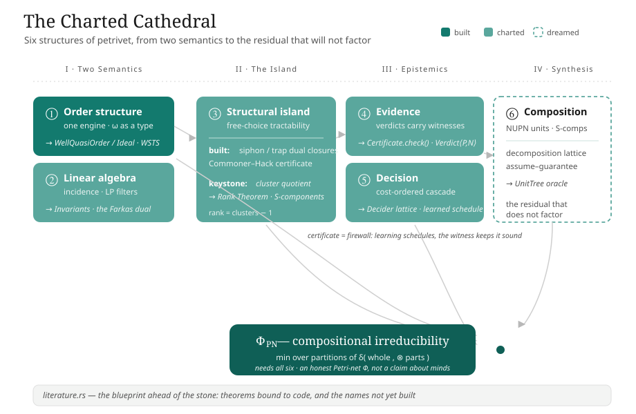

# The Charted Cathedral
### On the latent architecture of `petrivet`, and the future its seams already name

> Status: essay / vision. Claim-honest by intent — *implemented*, *charted-but-unbuilt*, and *dreamed/metaphorical* are kept distinct throughout. The deepest theory is Michael's; this is a reading of the seams.

There is a file in this repository that, more than any other, tells you what `petrivet` *is*. It is not a struct, not an algorithm, not a benchmark. It is [`literature.rs`](../../petrivet/src/literature.rs) — a Rust module that contains no executable code at all, only doc-comments, "a citation index" that maps the theorems of Murata, of Best–Devillers, of Esparza, onto the functions that implement them. And the remarkable thing about it is this: it deep-links to a module layer that does not exist. It references `structural::compute_invariants`, an `Invariants` type, an `SComponent`, a `crate::model` carrying `SNetLivenessEvidence` and `TNetLivenessEvidence` — names that resolve to nothing in [`lib.rs`](../../petrivet/src/lib.rs). The blueprint was drawn ahead of the stone.

This is not a flaw. It is the most interesting fact about the codebase, and it is what makes the question of *future potential* unusually answerable. In most software, "future potential" is a Rorschach test; you project onto it whatever you wish. Here, the author has already surveyed the ground. The gap between the names `literature.rs` invokes and the names that compile is a precise, self-authored map of the planned-but-unbuilt. So this essay is less an act of invention than of *reading the seams* — of taking six structures and showing how each is, in the codebase as it stands today, a load-bearing abstraction waiting one level of generality away from where the code currently rests.

A word on honesty before we begin. The thesis document in [`typst/masters`](../../typst/masters/thesis.typ) is, at present, an empty TUM template — the intellectual spine lives in the code and in `literature.rs`, not in the `.typ` files. The structural island is two-thirds charted and one-third built. Invariants are cited but not computed. And Integrated Information Theory appears *nowhere* in the repository — no Φ, no irreducibility, no partition in the relevant sense. The IIT thread is a lens brought from outside, and it is treated as exactly that: a disciplined proposal, rigorously grounded in the decomposition mathematics the code already has, and clearly fenced off from any claim about consciousness or about what Michael has written. Where this says "the code does X," it does. Where it says "the code could become Y," Y is a dream with coordinates.

The six concerns are not a list. They are an arc. Two of them — order and linear algebra — are the two great *semantics* of a Petri net, the two ways the theory has always reasoned about an unbounded state space without enumerating it. One — the structural island — is where those two semantics collapse into polynomial certainty. Two — evidence and decision — are the *epistemics*: how the tool knows, and how it chooses. And the last — composition — is the synthesis, where nets are put back together and we can finally ask how much the whole exceeds its parts. Let us walk the arc.

---

## Part I — Two Semantics

### ① The order structure: one engine, and the type that is infinity

The first thing to understand about `petrivet`'s state-space machinery is that there is only one of it. The reachability graph and the coverability graph are not two algorithms; they are [one generic engine](../../petrivet/src/core/state_space/mod.rs) parameterized by a single trait, `TokenOps`, that abstracts the per-place token scalar — its zero, its successor, its "is at least one." There are exactly two implementors. One is `u32`. The other is [`Omega`](../../petrivet/src/core/state_space/coverability.rs), the enum `{ Finite(u32), Unbounded }` — and `Omega` is infinity made into a type. Its arithmetic is absorptive: incrementing ω is a no-op, ω plus anything is ω, ω dominates every finite value. The Karp–Miller coverability graph, in this design, is *literally* the reachability graph run over ℕ ∪ {ω} instead of ℕ. The point is made unanswerable by a single function: [`TryFrom<CoverabilityGraph> for ReachabilityGraph`](../../petrivet/src/api/state_space/coverability.rs) — a bounded coverability graph, the one with no ω anywhere, *is* a reachability graph, recovered by unwrapping each `Finite(k)` to `k`.

This is genuinely elegant, and it is a fragment of one of the deepest results in verification: the theory of **Well-Structured Transition Systems** (Finkel; Abdulla; Finkel–Schnoebelen). A WSTS is any transition system equipped with a well-quasi-order on its states such that transitions are *monotone* with respect to that order — and for such systems, coverability is decidable, by exactly the ω-acceleration the code performs in [`omega_accelerate`](../../petrivet/src/core/state_space/coverability.rs): walk the ancestors, and wherever the new marking strictly dominates an ancestor, promote the strictly-greater coordinates to ω. Dickson's Lemma — that (ℕ^P, ≤) is a well-quasi-order — is what guarantees this terminates.

And here is the seam. The well-quasi-order is the one thing in this engine that is *not* abstracted. It is the blanket `impl<T: Ord> PartialOrd for IdxMarking<T>` in [`marking.rs`](../../petrivet/src/core/marking.rs) — the componentwise product order on a fixed-length vector, with its lovely little `merge_ordering` fold that returns `None` the moment two coordinates disagree in direction. A repository-wide search for `WellQuasiOrder`, `WSTS`, `Ideal`, `Dickson` returns nothing. The genericity that exists is over the *fiber* — the value living in each place — not over the *order on states*. The engine is one trait away from WSTS and does not know it.

What lifting that trait would buy is not abstraction for its own sake. Consider `Omega` again. It is, precisely, the *ideal completion* of (ℕ, ≤): the principal ideals ↓k together with the top ideal ℕ. The cross-type comparison the code already performs — a concrete `u32` marking measured against an `Omega` marking — is comparing a state against an ideal. This is the Finkel–Goubault-Larrecq theory of ideal completions of well-quasi-orders, hand-rolled for the special case of ℕ without naming itself. Generalize `Omega` to `Ideal<D>` over an arbitrary WQO domain, lift the product order to a `WellQuasiOrder` trait, re-express acceleration as "join with the limit of the dominating chain," and the same `DenseStateGraphExplorer` that drives Petri nets would drive *lossy channel systems* (the Higman order on words), *data nets* and *ν-Petri nets*, *broadcast protocols*, *BVASS*. The third implementor of `ExploreNext` would slot in beside `u32` and `Omega` like a key into a lock that was cut for it.

There is a nearer prize, too. The README is candid that reachability, liveness, and deadlock-freedom return [`Inconclusive`](../../petrivet/src/api/system/reachability.rs) for unbounded nets — the boundary lives at a single line, `if marking.has_omega() { return Inconclusive }` — and notes, correctly, that these problems are *decidable* but Ackermannian (the Leroux–Schmitz frontier). The `// todo: backwards coverability` markers in the code point exactly at the Abdulla-style backward algorithm, which is *defined* over upward-closed sets and their finite bases of minimal elements. The codebase already has the right substrate for that — [`UniqueSortedSlice`](../../petrivet/src/core/unique_sorted_slice.rs), with its O(n+m) subset and intersection scans, is a natural representation for the basis of an upward-closed set. An ideal-based forward analysis (expand-enlarge-check, Geeraerts–Raskin–Van Begin) would convert today's blanket `Inconclusive` into a refinement loop. The ω-marking that `analyze_coverability` *already* returns as a witness is the seed of the over-approximation such a loop would tighten.

So the order structure's future is a single sentence: **make the order abstract, and the engine you already wrote becomes a WSTS framework.**

### ② The linear-algebraic structure: the certificate the LP throws away

If the order semantics is how you reason about *reachability over-approximated upward*, the linear-algebraic semantics is how you reason about it *over-approximated by conservation laws*. A Petri net carries an incidence matrix C = Post − Pre, and the marking equation m = m₀ + C·σ is a necessary condition for reachability: if no nonnegative σ solves it, the target is unreachable, full stop. The kernel of Cᵀ — the P-invariants, the place-weightings y with yᵀC = 0 — are conservation laws, and each one bounds a weighted sum of tokens for all time.

`petrivet`'s realization of this is deliberately, almost austerely, thin, and understanding *why* is the key to its future. The only algebraic object is [`IncidenceMatrix`](../../petrivet/src/core/analysis/incidence.rs): a dense `Box<[i32]>` with exactly two methods, `new` and `get`. It cannot multiply, transpose, or compute a rank. There is no rational matrix type, no Gaussian elimination, no `num-rational` in the dependency tree. P- and T-invariants are *not computed anywhere* — they live only as prose and as the dangling doc-links to `structural::compute_invariants`. Everything genuinely algebraic is outsourced to a linear-programming solver: the [`semi_decision`](../../petrivet/src/core/analysis/semi_decision.rs) module builds the marking equation row by row into `good_lp` constraints and hands them to `microlp`. The library does not do linear algebra; it phrases linear algebra as feasibility and asks an LP.

This is a defensible, even shrewd, engineering choice — and it leaves one specific, beautiful thing on the floor. When the marking-equation LP is *infeasible*, the doc-comment for `UnreachabilityProof::MarkingEquationNoRationalSolution` says, in plain words, "Some S-invariant is violated." This is true, and it is provable, and the proof is *right there*: by Farkas's lemma, an infeasible system yields a dual certificate — a place-weighting y that is an actual P-invariant witnessing the contradiction, y·C = 0 with y·(m' − m₀) ≠ 0. But the code calls `.is_none()` and returns a unit enum variant. The Farkas dual — the single most valuable algebraic object in the entire analysis, a checkable, human-legible conservation law that *explains* the unreachability — is computed by the solver and discarded at the boundary.

The future here writes itself, and it is small. Extract the dual. Add `MarkingEquationNoRationalSolution(SInvariant)`. Now the negative verdict carries a certificate symmetric to the positive ones. And once you want exact integer invariants rather than the LP's rational shadow, you are one modest component away: a small exact-rational matrix core over the existing dense `IncidenceMatrix`. That core is a fulcrum. It gives you *rank* — and rank is the missing ingredient for the Rank Theorem of Part II. It gives you *null-space bases* — and those are the P- and T-semiflows, the Colom–Silva minimal generators, that `literature.rs` promises and `compute_invariants` was named to deliver. It gives you Hermite and Smith normal forms, and with them the integer reasoning that sharpens the state equation past its rational relaxation. The marking equation, today a one-shot filter, becomes the seed of an Esparza–Melzer-style *refinement loop*: solve, and on spurious feasibility, add the trap and siphon constraints that the firing-order-blind equation ignores, and re-solve.

Notice what has happened across §1 and §2. Both semantics are *completions*. The order side completes the reachability relation upward, into ideals, with ω as the limit. The algebra side completes the incidence matrix into its kernel, into invariants, with Farkas duality as the certificate. One is order-theoretic, one is linear, and they are the two faces — the dynamic and the structural — of the same refusal to enumerate the state space. Classical Petri net theory has always been the dialogue between them. `petrivet` has built the first completion beautifully and left the second as a charted absence. To build the invariant layer is not to add a feature; it is to give the linear semantics the same voice the order semantics already has.

---

## Part II — The Island

### ③ The structural island: dual closures, and the keystone not yet cut

There is a region of Petri net theory where the two great over-approximations stop being approximations. For *free-choice* nets, liveness is decided exactly, in polynomial time, by a purely structural condition — Commoner's theorem — and boundedness is decided exactly by the rank of the incidence matrix against the number of clusters. This is the tractable island, the Desel–Esparza country, and it is the philosophical heart of `petrivet`: the README's promise to "intelligently choose the most efficient algorithm for your net's structure" is the promise to *land on the island whenever the net is shaped to allow it.*

What is built on the island is genuinely lovely. Siphons and traps — the structural duals that govern token starvation and token trapping — are computed by [`maximal_siphon_in`](../../petrivet/src/core/analysis/siphon_trap.rs) and `maximal_trap_in`, and these two functions are *exact De Morgan duals of each other*: the same shrinking shape ("while some place is bad, remove it") instantiated with mirror-image conditions. They are closure operators — each computes the unique maximal siphon or trap inside a set — though the code never names them as such. And the use the code makes of them is the cleverest single move in the repository. The Commoner/Hack criterion needs to know whether every minimal siphon contains a *marked trap*. The naive route enumerates all traps and tests containment. `commoner_hack_criterion` instead enumerates minimal siphons and, for each, computes the maximal trap *inside* it — because "the siphon contains a marked trap" if and only if "the maximal trap in the siphon is marked." One closure operator answers an existential-over-subsets question in a single shot. The result is returned as a [`Result<Box<[SiphonTrapPair]>, UnmarkedSiphonTrapPair>`](../../petrivet/src/api/system/chc.rs): on success, every siphon paired with its marking witness; on failure, the exact unmarked siphon that can starve — a deadlock certificate.

And then the island stops, abruptly, at the waterline. The word *cluster* appears exactly once in the entire crate — in a doc-comment in [`class.rs`](../../petrivet/src/core/class.rs) transcribing the Rank Theorem: "the rank of the incidence matrix of N is equal to c − 1, where c is the number of clusters." There is no cluster construction. There is no rank function (recall §2: `IncidenceMatrix` has only `new` and `get`). [`is_covered_by_s_components`](../../petrivet/src/api/net/mod.rs) returns a hardcoded `false` with a bare `// todo`. The S-component decomposition, the Rank Theorem, the whole `structural::` module that `literature.rs` deep-links into — charted, named, and absent.

The future of the island is a single missing keystone, and it is worth naming precisely because it is so reachable: **the cluster quotient.** A cluster is the equivalence class generated by the relations "place s feeds transition t" — the connected components of the place-transition coupling. With the presets and postsets already stored as `UniqueSortedSlice`s on the net, a union-find computes the cluster partition cheaply. And that single quotient unlocks *both* halves of the island at once. It gives you the count c that the Rank Theorem needs — and paired with the exact-rational rank routine from §2, the theorem becomes a polynomial, certificate-bearing decision of simultaneous liveness-and-boundedness, replacing the `false`-returning stub. And it gives you the S-component and T-component decompositions — the `s_components`/`t_components` the literature module already documents as if they existed — which are themselves sub-nets, analyzable in isolation, composable in their verdicts. The cluster quotient is where the structural island reaches forward into Part IV: it is the same partition that composition will need.

Step back and a pattern across §1–§3 comes into focus, the deepest aesthetic unity in the codebase. Everything is an *order*, a *completion*, a *closure*, or a *quotient*. The marking order (①). The ideal completion `Omega` (①) and the linear completion into invariants (②). The siphon/trap closures (③) and the upward-closed bases backward coverability would need (①). The cluster quotient, the S-component decomposition, the NUPN nesting (③, ⑥). The future of the mathematical core is the act of making each of these four constructions *abstract* — a `WellQuasiOrder`, a `Completion`, a `Closure`, a `Quotient` — so that the engine written once for markings runs everywhere the structure recurs. The code is already four abstractions; it simply spells them out longhand.

---

## Part III — Epistemics

### ④ The evidence structure: from inert data toward a calculus of certificates

Here the codebase reveals an instinct that is, to my reading, its most quietly radical commitment: *an analysis result should not be a boolean.* Look at what the verdicts carry. [`ReachabilityProof`](../../petrivet/src/api/system/reachability.rs) is a four-way enum, and its variants carry genuinely different witnesses — a scalar token sum for the state-machine case, a *Parikh firing-count vector* for the marked-graph case, a replayable *firing sequence* for the general case. [`CoverabilityProof`](../../petrivet/src/api/system/coverability.rs) carries both a firing sequence *and* an ω-marking that dominates the target. The Commoner/Hack result carries its siphon/trap pairs as positive evidence or its unmarked siphon as a counterexample. This is the vocabulary of *certifying algorithms* — McConnell, Mehlhorn, Näher, Schweitzer — in which a procedure returns not just an answer but a witness a skeptical third party can check without trusting the procedure.

But it is, today, an instinct rather than a calculus, and the honest gaps are instructive. There is no shared `Verdict<Proof, Disproof>` abstraction — the five properties wear five different shapes (a three-arm enum, a two-arm enum, a `Result`, a `{values, method}` struct, a bare `bool`). The `Result<evidence, counterexample>` pattern, which is exactly the right shape, appears in exactly one place. The proof objects are *inert*: there is no `verify()` anywhere, no `Certificate` trait, nothing that re-runs the cheap check. A caller handed `FiringSequence([t0, t1, t2])` must trust that the sequence fires; it cannot ask the proof to validate itself. And there is one genuine soundness hazard worth flagging plainly: for unbounded nets, [`analyze_liveness`](../../petrivet/src/api/system/liveness.rs) returns *every transition as L0* tagged with `LivenessMethod::Inconclusive` — and L0 is also the value a genuinely dead transition receives. "We don't know" and "provably dead" are distinguished only by a sibling field that the boolean convenience wrappers discard. The verdict and the not-a-verdict wear the same face.

The future is the trait that is already implied by every payload in the system:

```rust
trait Certificate {
    fn check(&self, net: &DenseNet, m0: &Marking) -> bool;
}
```

The data is already certificate-shaped and, crucially, already *serializable* — every witness is plain owned data, no borrows, no closures. A `FiringSequence` checks by replaying against the existing `is_enabled`/`fire` machinery; a marking-equation proof checks by recomputing m₀ + C·σ from its stored Parikh vector; a siphon/trap pair checks by re-verifying the closure conditions the code already knows how to test; and the Farkas dual from §2, once extracted, checks by a single dot product. Unify the five shapes behind one `Verdict<P, N>` carrying an explicit `Inconclusive`, and the liveness hazard becomes *type-enforced* rather than convention-dependent. None of this requires new theory. It requires *retaining and typing the evidence the code already touches* — and the prize is a proof-carrying analysis tool whose certificates an external SMT solver, a referee, or a future version of the tool itself can audit offline.

### ⑤ The decision structure: a lattice of partial deciders, and why a learned scheduler would be sound

Now the most consequential idea. `petrivet` is, in fact, a *portfolio solver* — it just does not know it yet. For each property it runs an ascending-cost cascade of partial deciders. Reachability, for instance: trivial equality, then S-net token conservation, then a live-T-net integer marking equation, then a rational LP filter, then an integer ILP filter, then full state-space exploration — each gated by structural class, each tried only if the cheaper ones were inconclusive. This cascade is real, it is tuned, and it is the operational meaning of "land on the island first."

It is also entirely hardcoded — a `match self.class()` repeated across five sibling files, with the cost ordering living implicitly in the top-to-bottom order of statements inside each `analyze_*` method. There is no `Decider` trait. The crucial metadata — each decider's *polarity* (can it only prove YES? only prove NO? both?), its *cost class*, its *soundness domain* (the marking equation is exact for state machines by total unimodularity; CHC is exact for free-choice liveness; both are merely one-sided elsewhere) — lives only in doc-comments, legible to humans and invisible to code. And two arms of the cascade are latent hazards: `is_covered_by_s_components` and the marked-graph liveness branch both return a definitive `Some(false)` where the theory gives an exact decision, so the fast layer can presently *understate* what it should prove.

Lift the cascade into data — a `Decider` trait that declares `polarity`, `cost`, and `admissible(class)` — and the `analyze_*` methods become a driver: gather the admissible deciders, run in cost order, accept the first that returns a certificate. The default schedule reproduces today's behavior exactly. But now the schedule is a *parameter*. And this is where the deepest connection in the entire system snaps into place — the connection between concern ④ and concern ⑤.

> **The certificate is the firewall that makes learning sound.**

Because every decider is independently sound on its declared domain, and because acceptance requires an actual certificate (concern ④), the *order* in which deciders are tried cannot affect the answer — only the time to reach it. This means you can put a machine-learned policy in charge of scheduling — a SATzilla-style selector trained on cheap structural features that are *already computed*: the net class, the place and transition counts, strong-connectivity. The learned policy predicts *which decider will fire first* and orders accordingly. It can be arbitrarily, embarrassingly wrong — and the tool's verdicts remain perfectly sound, because a wrong guess merely wastes time before falling through to the exhaustive method, and a *right* verdict is never accepted without its witness. Learning does scheduling; the certificate does soundness; the two never touch. This is how you put a heuristic — even a neural network — inside a soundness-critical verifier without a moment's anxiety. It is the cleanest possible separation of "fast" from "correct," and the codebase is one trait and one telemetry hook away from it. (The one prerequisite is to fix those two `Some(false)` stubs, so that "fast" never silently means "wrong.")

The anytime corollary is free: the deciders are pure functions of the net, so the cheap ones — LP, ILP, CHC, the structural-boundedness test — can be *raced in parallel*, first certificate wins, the rest cancelled. A learned, parallel, certificate-gated portfolio over a lattice of partial deciders is not a research fantasy here; it is the natural completion of the dispatch that already exists.

---

## Part IV — Synthesis

### ⑥ The compositional structure, and the integrated-information thread made rigorous

Everything so far has analyzed *one* net. The final concern asks how nets come apart and go back together — and it is where the codebase is most purely potential, and where the IIT lens, handled carefully, becomes something genuinely precise.

The honest state of the ground first. The repository parses **NUPN** — Nested-Unit Petri Nets, the Model Checking Contest's hierarchical format — into [`NupnStructure`](../../petrivet/src/api/pnml/nupn.rs): a forest of units, each owning local places and naming child units, rooted, with a `unit_safe` flag asserting a one-token-per-unit invariant. The fixtures contain real, deep unit trees. And *no analysis code reads any of it.* The hierarchy is flattened away during conversion; the only consumers of the parsed NUPN are tests. The `unit_safe` flag — which is a genuine, exploitable linear invariant — is never verified and never used. There is no composition operator anywhere: no `compose`, no gluing of nets along shared interface places, no monoid, no category. The "boundary spec" in [`docs`](../petrivet-boundary-spec.md) is about *software* boundaries — Rust versus WASM versus browser — not open-net interfaces. NUPN today is a decomposition oracle that the analysis has not yet learned to consult.

And IIT? It is not in the repository. Not in the code, the comments, the commits, or the thesis. So let me state the bridge as what it is — a proposal, mathematically sound and worth making precise — and fence it from any claim it does not earn.

Strip Integrated Information Theory of its phenomenology and its specific probability metric, and its mathematical kernel is this: a system has high integrated information when its whole behavior *does not factor* over any partition of its parts. Φ is a minimum, over all cuts, of a distance between the whole and the product of the parts-under-that-cut; the minimizing cut is the *minimum information partition*, and Φ > 0 means the system is irreducible — no decomposition recovers it. Now look at what `petrivet` has. A NUPN unit tree is *exactly a candidate partition* of a net's places, and cutting the tree at any antichain of units yields a whole *lattice* of partitions. And the verdict calculus of concern ④ is exactly a notion of "the whole's behavior." So define, for a chosen property and a net N:

$$\Phi_{\mathrm{PN}}(N) \;=\; \min_{\pi \in \Pi(N)} \; \delta\!\Big(\; \mathrm{Verdict}(N), \;\; \bigotimes_{u \in \pi} \mathrm{Verdict}(N\!\restriction\! u) \;\Big)$$

where Π(N) is the decomposition lattice (NUPN units, or the S-components of §3 when no NUPN block is present), N↾u is the sub-net induced by a unit, ⊗ is the property-specific composition rule — verdict-join for booleans, direct-sum-plus-interface-correction for invariant spaces, max for place bounds — and δ measures how far the composed answer falls short of the true global one.

This is real mathematics, not metaphor. It is a minimum, over a well-defined lattice, of a well-defined factorization residual, and every ingredient is grounded in types the code has or is one resolution-pass from having. Φ_PN = 0 certifies that the property is *compositionally reducible*: the net factors over some declared decomposition, and analysis can proceed unit-by-unit. Φ_PN > 0 means the property is *irreducible* — a genuinely global fact that no unit decomposition recovers — and the witnessing minimum cut tells the engineer *exactly which cross-unit coupling defeats modularity.* That is an honest "Petri-net Φ": a number, and a witness, measuring failure-to-factor. It says nothing about minds. The leap from this residual to consciousness is precisely the part that is metaphor, and I will not take it; IIT's full apparatus — the cause-effect repertoires, the intrinsic-difference metric, the exclusion postulate — would require a stochastic semantics this qualitative analyzer does not have, and importing it would be inventing structure rather than reflecting it.

But notice *why* Φ_PN is the right capstone for the whole arc, and not merely the sixth item on a list. To compute it you need all five prior structures at once. You need the **order engine** (①) to compute the global verdict. You need the **structural decomposition** (③) — the cluster quotient and its S-components — to generate the partition lattice when no NUPN is given. You need the **linear-algebraic** layer (②) to define ⊗ on invariant spaces and the interface-coupling correction. You need the **certificate calculus** (④) to give δ a meaning — to define what it is for two verdicts to *disagree*, and to witness the disagreement. And you need the **decision portfolio** (⑤) to make the per-unit analyses cheap enough that minimizing over a lattice of partitions is tractable. Φ_PN is the point where the six concerns converge. It is the quantity the architecture is, in some latent sense, *built to compute* — and the fact that it coincides with the rigorous core of the integration idea is, I think, not an accident but a sign that the decomposition instinct in NUPN and the integration instinct in IIT are two readings of the same lattice.

---

## Coda — The dream is completion, not invention

Let me gather the arc into the abstractions that, if drawn, would finish the cathedral — each one already named or implied by the stone that stands.

- **`WellQuasiOrder` / `Ideal`** (①) — the order lifted off the marking vector, and `Omega` generalized from the ideal completion of ℕ to the ideal completion of any WQO. The engine becomes WSTS; the `Inconclusive` frontier becomes a refinement loop.
- **An exact-rational core / `Invariants`** (②) — rank, null-space, and the Farkas dual the LP currently discards. The linear semantics gains the certificate-voice the order semantics already has.
- **The cluster quotient / `Closure`** (③) — one union-find that unlocks both the Rank Theorem and the S-component decomposition, and reaches forward into composition.
- **`Certificate` / `Verdict<P, N>`** (④) — `check()` on every proof, one shape for every property, "inconclusive" made un-confusable with "false."
- **`Decider` + a learned schedule** (⑤) — the cascade as data, the order as a soundness-free parameter a machine may learn.
- **`UnitTree` + Φ_PN** (⑥) — the decomposition oracle consulted at last, and the irreducibility residual made computable.

Every one of these has a doc-link, a `// todo`, a stub, or a charted name pointing at it today. That is the gift `literature.rs` gives: it has already told us where the walls go. The future of `petrivet` is not a pivot or a rewrite. It is the patient act of building the layer the blueprint already names — of making abstract the four constructions (order, completion, closure, quotient) the code currently spells out by hand, and of letting the certificate calculus (④) and the decider lattice (⑤) turn a fast analyzer into a *trustworthy* and *learned* one.

And there is a closing symmetry. The motto in the README is "bringing Petri net theory and application together." Most projects would mean that as an aspiration. Here it is enacted, literally, by a file: `literature.rs` is the seam where a published theorem and a Rust function are made to point at each other. The theory the tool cites and the code the tool runs are bound in one place — and the unbuilt names in that file are not a backlog so much as a *promise the architecture has made to itself.* The work is Michael's, and the deepest moves belong to him; what these notes try to honor is that the seams were cut with the next generality already in mind. The cathedral is charted in full. Much of it is built. The rest is waiting, in named stone, to be raised.



---

*Provenance: produced by studying the codebase with parallel reader-agents, one per concern plus one for the theoretical spine (`literature.rs`, the thesis scaffolding, the boundary spec, the commit history). Every "the code does X" was checked against an exact `file:line`; every "could become Y" is anchored to an existing `todo`, stub, or dangling doc-link. The IIT/Φ thread is a lens brought from outside and developed only in its factorization-residual form.*
