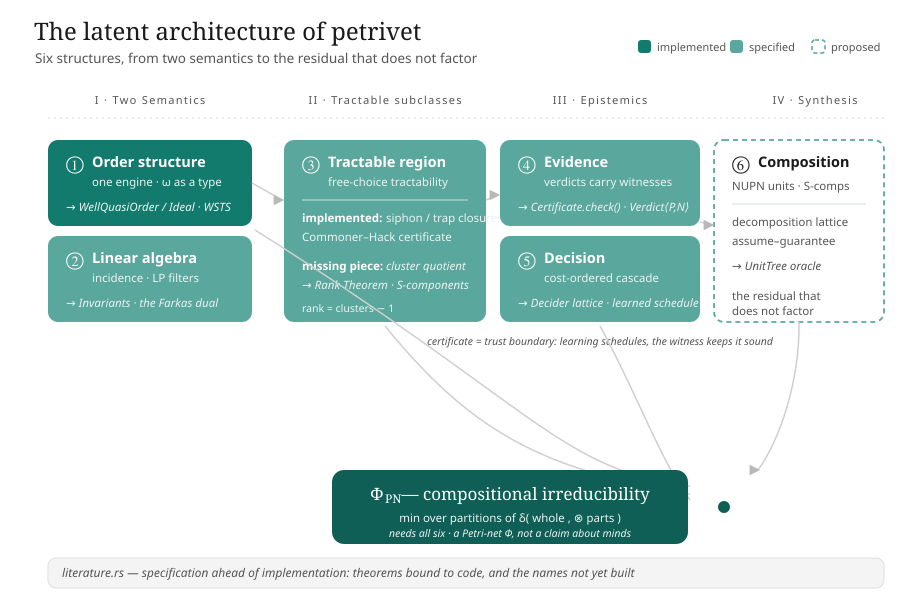

# The Latent Architecture of `petrivet`

> Status: design analysis. This document distinguishes three categories throughout: *implemented* (present and executable in the codebase today), *specified but not implemented* (named in documentation or referenced by dangling links, but not built), and *proposed/speculative* (an extension argued for here, grounded in the existing decomposition mathematics but not part of the project's stated scope). The core theory is Michael's; this document is an analysis of the codebase's structure and its planned extensions.

## 1. The role of `literature.rs`

One file in this repository describes what `petrivet` is intended to be more directly than any struct, algorithm, or benchmark. It is [`literature.rs`](../../petrivet/src/literature.rs), a Rust module that contains no executable code, only doc-comments — a citation index mapping theorems of Murata, Best–Devillers, and Esparza onto the functions intended to implement them. It deep-links to a module layer that does not yet exist. It references `structural::compute_invariants`, an `Invariants` type, an `SComponent`, and a `crate::model` carrying `SNetLivenessEvidence` and `TNetLivenessEvidence` — names that resolve to nothing in [`lib.rs`](../../petrivet/src/lib.rs). The documentation was written ahead of the implementation.

This is not a defect; it is the most informative property of the codebase, and it makes the question of future direction unusually concrete. The gap between the names `literature.rs` invokes and the names that compile is a precise, author-supplied map of what is planned but not built. This document is therefore an analysis of that gap: it takes six structures and shows how each is, in the codebase as it stands, a load-bearing abstraction that sits one level of generality away from where the code currently rests.

A note on scope. The thesis document in [`typst/masters`](../../typst/masters/thesis.typ) is at present an empty TUM template; the technical content lives in the code and in `literature.rs`, not in the `.typ` files. The structural-analysis region is roughly two-thirds specified and one-third implemented. Invariants are cited but not computed. Integrated Information Theory (IIT) appears nowhere in the repository — no Φ, no irreducibility, no partition in the relevant sense. The IIT material here is brought in from outside and treated as such: a proposal grounded in the decomposition mathematics the code already has, and explicitly separated from any claim about consciousness or about Michael's written work. Statements of the form "the code does X" are verifiable against the codebase. Statements of the form "the code could become Y" describe proposed extensions anchored to existing `todo`s, stubs, or dangling links.

The six concerns form a sequence. Two of them — order and linear algebra — are the two principal semantics of a Petri net, the two ways the theory reasons about an unbounded state space without enumerating it. One — the structurally tractable region — is where those two semantics yield polynomial-time exact decisions. Two — evidence and decision — concern epistemics: how the tool establishes results, and how it selects methods. The last — composition — is the synthesis, where nets are recombined and one can ask how much the whole exceeds its parts.

---

## Part I — Two Semantics

### 2. The order structure: one engine, and the ω type

The state-space machinery has a single implementation. The reachability graph and the coverability graph are not two algorithms; they are [one generic engine](../../petrivet/src/core/state_space/mod.rs) parameterized by a single trait, `TokenOps`, that abstracts the per-place token scalar — its zero, its successor, its "is at least one" test. There are exactly two implementors. One is `u32`. The other is [`Omega`](../../petrivet/src/core/state_space/coverability.rs), the enum `{ Finite(u32), Unbounded }`, which represents infinity as a type. Its arithmetic is absorptive: incrementing ω is a no-op, ω plus any value is ω, and ω dominates every finite value. In this design the Karp–Miller coverability graph is the reachability graph run over ℕ ∪ {ω} instead of ℕ. A single function makes this explicit: [`TryFrom<CoverabilityGraph> for ReachabilityGraph`](../../petrivet/src/api/state_space/coverability.rs) — a bounded coverability graph, one containing no ω, is a reachability graph, recovered by unwrapping each `Finite(k)` to `k`.

This is a fragment of one of the central results in verification: the theory of **Well-Structured Transition Systems** (Finkel; Abdulla; Finkel–Schnoebelen). A WSTS is any transition system equipped with a well-quasi-order on its states such that transitions are *monotone* with respect to that order. For such systems, coverability is decidable via the ω-acceleration the code performs in [`omega_accelerate`](../../petrivet/src/core/state_space/coverability.rs): walk the ancestors, and wherever the new marking strictly dominates an ancestor, promote the strictly-greater coordinates to ω. Dickson's Lemma — that (ℕ^P, ≤) is a well-quasi-order — guarantees termination.

The well-quasi-order is the one element of this engine that is not abstracted. It is the blanket `impl<T: Ord> PartialOrd for IdxMarking<T>` in [`marking.rs`](../../petrivet/src/core/marking.rs) — the componentwise product order on a fixed-length vector, with a `merge_ordering` fold that returns `None` as soon as two coordinates disagree in direction. A repository-wide search for `WellQuasiOrder`, `WSTS`, `Ideal`, or `Dickson` returns nothing. The genericity that exists is over the *fiber* — the value living in each place — not over the *order on states*. The engine is one trait away from a WSTS framework.

Lifting that trait has concrete payoff. `Omega` is the *ideal completion* of (ℕ, ≤): the principal ideals ↓k together with the top ideal ℕ. The cross-type comparison the code already performs — a concrete `u32` marking measured against an `Omega` marking — compares a state against an ideal. This is the Finkel–Goubault-Larrecq theory of ideal completions of well-quasi-orders, implemented by hand for the special case of ℕ without being named as such. Generalizing `Omega` to `Ideal<D>` over an arbitrary WQO domain, lifting the product order to a `WellQuasiOrder` trait, and re-expressing acceleration as "join with the limit of the dominating chain" would let the same `DenseStateGraphExplorer` that drives Petri nets also drive *lossy channel systems* (the Higman order on words), *data nets* and *ν-Petri nets*, *broadcast protocols*, and *BVASS*. A third implementor of `ExploreNext` would fit beside `u32` and `Omega` using the existing interface.

There is also a nearer extension. The README states that reachability, liveness, and deadlock-freedom return [`Inconclusive`](../../petrivet/src/api/system/reachability.rs) for unbounded nets — the boundary is a single line, `if marking.has_omega() { return Inconclusive }` — and notes correctly that these problems are *decidable* but Ackermannian (the Leroux–Schmitz frontier). The `// todo: backwards coverability` markers point at the Abdulla-style backward algorithm, which is *defined* over upward-closed sets and their finite bases of minimal elements. The codebase already has a suitable substrate: [`UniqueSortedSlice`](../../petrivet/src/core/unique_sorted_slice.rs), with its O(n+m) subset and intersection scans, is a natural representation for the basis of an upward-closed set. An ideal-based forward analysis (expand-enlarge-check; Geeraerts–Raskin–Van Begin) would convert today's blanket `Inconclusive` into a refinement loop. The ω-marking that `analyze_coverability` already returns as a witness is the starting over-approximation such a loop would tighten.

The summary for the order structure: making the order abstract turns the existing engine into a WSTS framework.

### 3. The linear-algebraic structure: the discarded Farkas certificate

If the order semantics reasons about reachability over-approximated upward, the linear-algebraic semantics reasons about it over-approximated by conservation laws. A Petri net carries an incidence matrix C = Post − Pre, and the marking equation m = m₀ + C·σ is a necessary condition for reachability: if no nonnegative σ solves it, the target is unreachable. The kernel of Cᵀ — the P-invariants, the place-weightings y with yᵀC = 0 — are conservation laws, each bounding a weighted sum of tokens for all time.

`petrivet`'s realization of this is deliberately thin, and understanding why explains its planned direction. The only algebraic object is [`IncidenceMatrix`](../../petrivet/src/core/analysis/incidence.rs): a dense `Box<[i32]>` with exactly two methods, `new` and `get`. It cannot multiply, transpose, or compute a rank. There is no rational matrix type, no Gaussian elimination, and no `num-rational` in the dependency tree. P- and T-invariants are *not computed anywhere*; they exist only as prose and as the dangling doc-links to `structural::compute_invariants`. Everything genuinely algebraic is delegated to a linear-programming solver: the [`semi_decision`](../../petrivet/src/core/analysis/semi_decision.rs) module builds the marking equation row by row into `good_lp` constraints and hands them to `microlp`. The library does not perform linear algebra; it phrases linear algebra as feasibility and queries an LP.

This is a reasonable engineering choice, but it discards one specific result. When the marking-equation LP is *infeasible*, the doc-comment for `UnreachabilityProof::MarkingEquationNoRationalSolution` states "Some S-invariant is violated." This is provable, and the proof is available: by Farkas's lemma, an infeasible system yields a dual certificate — a place-weighting y that is an actual P-invariant witnessing the contradiction, y·C = 0 with y·(m' − m₀) ≠ 0. But the code calls `.is_none()` and returns a unit enum variant. The Farkas dual — a checkable, human-readable conservation law that *explains* the unreachability — is computed by the solver and discarded at the boundary.

The extension here is small. Extract the dual. Add `MarkingEquationNoRationalSolution(SInvariant)`. The negative verdict then carries a certificate symmetric to the positive ones. To obtain exact integer invariants rather than the LP's rational result, one additional component is needed: a small exact-rational matrix core over the existing dense `IncidenceMatrix`. That core is a primary dependency for several later features. It gives *rank* — the missing ingredient for the Rank Theorem of Part II. It gives *null-space bases* — the P- and T-semiflows, the Colom–Silva minimal generators that `literature.rs` promises and `compute_invariants` was named to deliver. It gives Hermite and Smith normal forms, and with them the integer reasoning that sharpens the state equation past its rational relaxation. The marking equation, today a one-shot filter, would become the seed of an Esparza–Melzer-style *refinement loop*: solve, and on spurious feasibility, add the trap and siphon constraints that the firing-order-blind equation ignores, then re-solve.

Both semantics are *completions*. The order side completes the reachability relation upward, into ideals, with ω as the limit. The algebra side completes the incidence matrix into its kernel, into invariants, with Farkas duality as the certificate. One is order-theoretic, one is linear; they are the dynamic and structural faces of the same refusal to enumerate the state space. Classical Petri net theory has always combined them. `petrivet` has implemented the first completion and left the second specified but not implemented. Building the invariant layer gives the linear semantics the same certificate-bearing capability the order semantics already has.

---

## Part II — The Tractable Region

### 4. The structurally tractable region: dual closures, and the missing cluster quotient

There is a region of Petri net theory where the two over-approximations become exact. For *free-choice* nets, liveness is decided exactly, in polynomial time, by a purely structural condition — Commoner's theorem — and boundedness is decided exactly by the rank of the incidence matrix against the number of clusters. This is the tractable region, the Desel–Esparza results, and it is central to `petrivet`: the README's promise to "intelligently choose the most efficient algorithm for your net's structure" amounts to using this region whenever the net's structure permits.

What is implemented here is substantial. Siphons and traps — the structural duals governing token starvation and token trapping — are computed by [`maximal_siphon_in`](../../petrivet/src/core/analysis/siphon_trap.rs) and `maximal_trap_in`, and these two functions are exact De Morgan duals of each other: the same shrinking procedure ("while some place is bad, remove it") instantiated with mirror-image conditions. They are closure operators — each computes the unique maximal siphon or trap inside a set — though the code does not name them as such. Their use is the most notable single technique in the repository. The Commoner/Hack criterion needs to know whether every minimal siphon contains a *marked trap*. The naive route enumerates all traps and tests containment. `commoner_hack_criterion` instead enumerates minimal siphons and, for each, computes the maximal trap inside it — because "the siphon contains a marked trap" if and only if "the maximal trap in the siphon is marked." One closure operator answers an existential-over-subsets question in a single computation. The result is returned as a [`Result<Box<[SiphonTrapPair]>, UnmarkedSiphonTrapPair>`](../../petrivet/src/api/system/chc.rs): on success, every siphon paired with its marking witness; on failure, the exact unmarked siphon that can starve, which is a deadlock certificate.

The implemented region stops abruptly. The word *cluster* appears exactly once in the entire crate — in a doc-comment in [`class.rs`](../../petrivet/src/core/class.rs) transcribing the Rank Theorem: "the rank of the incidence matrix of N is equal to c − 1, where c is the number of clusters." There is no cluster construction. There is no rank function (see §3: `IncidenceMatrix` has only `new` and `get`). [`is_covered_by_s_components`](../../petrivet/src/api/net/mod.rs) returns a hardcoded `false` with a bare `// todo`. The S-component decomposition, the Rank Theorem, and the entire `structural::` module that `literature.rs` deep-links into are specified, named, and not implemented.

The missing piece is a single construction, and naming it precisely matters because it is so reachable: **the cluster quotient.** A cluster is the equivalence class generated by the relation "place s feeds transition t" — the connected components of the place-transition coupling. With the presets and postsets already stored as `UniqueSortedSlice`s on the net, a union-find computes the cluster partition cheaply. That single quotient unlocks both halves of this region at once. It provides the count c that the Rank Theorem needs; paired with the exact-rational rank routine from §3, the theorem becomes a polynomial-time, certificate-bearing decision of simultaneous liveness-and-boundedness, replacing the `false`-returning stub. It also provides the S-component and T-component decompositions — the `s_components`/`t_components` the literature module documents as if they existed — which are themselves sub-nets, analyzable in isolation and composable in their verdicts. The cluster quotient connects forward to Part IV: it is the same partition that composition requires.

A pattern runs across §2–§4: every construction is an *order*, a *completion*, a *closure*, or a *quotient*. The marking order (§2). The ideal completion `Omega` (§2) and the linear completion into invariants (§3). The siphon/trap closures (§4) and the upward-closed bases backward coverability would need (§2). The cluster quotient, the S-component decomposition, and the NUPN nesting (§4, §7). Making each of these four constructions abstract — a `WellQuasiOrder`, a `Completion`, a `Closure`, a `Quotient` — would let the engine written once for markings operate wherever the structure recurs. The code already implements these four constructions; it simply writes them out in full each time.

---

## Part III — Epistemics

### 5. The evidence structure: from data toward a calculus of certificates

The codebase reflects a deliberate commitment: an analysis result should not be a boolean. The verdicts carry witnesses. [`ReachabilityProof`](../../petrivet/src/api/system/reachability.rs) is a four-way enum whose variants carry different witnesses — a scalar token sum for the state-machine case, a *Parikh firing-count vector* for the marked-graph case, a replayable *firing sequence* for the general case. [`CoverabilityProof`](../../petrivet/src/api/system/coverability.rs) carries both a firing sequence and an ω-marking that dominates the target. The Commoner/Hack result carries its siphon/trap pairs as positive evidence or its unmarked siphon as a counterexample. This is the model of *certifying algorithms* (McConnell, Mehlhorn, Näher, Schweitzer), in which a procedure returns not only an answer but a witness that an independent checker can verify without trusting the procedure.

At present this is a tendency rather than a uniform calculus, and the gaps are instructive. There is no shared `Verdict<Proof, Disproof>` abstraction — the five properties take five different shapes (a three-arm enum, a two-arm enum, a `Result`, a `{values, method}` struct, a bare `bool`). The `Result<evidence, counterexample>` pattern, which is the appropriate shape, appears in exactly one place. The proof objects are *inert*: there is no `verify()` anywhere, no `Certificate` trait, nothing that re-runs the cheap check. A caller handed `FiringSequence([t0, t1, t2])` must trust that the sequence fires; it cannot ask the proof to validate itself. One genuine soundness hazard is worth stating plainly: for unbounded nets, [`analyze_liveness`](../../petrivet/src/api/system/liveness.rs) returns *every transition as L0* tagged with `LivenessMethod::Inconclusive` — and L0 is also the value a genuinely dead transition receives. "We don't know" and "provably dead" are distinguished only by a sibling field that the boolean convenience wrappers discard.

The extension is the trait implied by every payload in the system:

```rust
trait Certificate {
    fn check(&self, net: &DenseNet, m0: &Marking) -> bool;
}
```

The data is already certificate-shaped and, importantly, already *serializable* — every witness is plain owned data, with no borrows or closures. A `FiringSequence` checks by replaying against the existing `is_enabled`/`fire` machinery; a marking-equation proof checks by recomputing m₀ + C·σ from its stored Parikh vector; a siphon/trap pair checks by re-verifying the closure conditions the code already tests; and the Farkas dual from §3, once extracted, checks by a single dot product. Unifying the five shapes behind one `Verdict<P, N>` carrying an explicit `Inconclusive` makes the liveness hazard type-enforced rather than convention-dependent. None of this requires new theory. It requires retaining and typing the evidence the code already handles, yielding a proof-carrying analysis tool whose certificates an external SMT solver, an independent checker, or a future version of the tool can audit offline.

### 6. The decision structure: a lattice of partial deciders, and the soundness of a learned scheduler

`petrivet` is a *portfolio solver*, though it is not yet structured as one. For each property it runs an ascending-cost cascade of partial deciders. For reachability: trivial equality, then S-net token conservation, then a live-T-net integer marking equation, then a rational LP filter, then an integer ILP filter, then full state-space exploration — each gated by structural class, each tried only if the cheaper ones were inconclusive. This cascade is implemented and tuned, and it is the operational meaning of trying the tractable region first.

It is also entirely hardcoded — a `match self.class()` repeated across five sibling files, with the cost ordering living implicitly in the top-to-bottom order of statements inside each `analyze_*` method. There is no `Decider` trait. The relevant metadata — each decider's *polarity* (can it only prove YES, only prove NO, or both?), its *cost class*, and its *soundness domain* (the marking equation is exact for state machines by total unimodularity; CHC is exact for free-choice liveness; both are one-sided elsewhere) — lives only in doc-comments, readable by humans and invisible to code. Two arms of the cascade are latent hazards: `is_covered_by_s_components` and the marked-graph liveness branch both return a definitive `Some(false)` where the theory gives an exact decision, so the fast layer can currently understate what it should prove.

Lifting the cascade into data — a `Decider` trait declaring `polarity`, `cost`, and `admissible(class)` — turns the `analyze_*` methods into a driver: gather the admissible deciders, run in cost order, accept the first that returns a certificate. The default schedule reproduces today's behavior exactly. But the schedule then becomes a *parameter*, which connects §5 and §6.

**The certificate is the trust boundary that makes learning sound.**

Because every decider is independently sound on its declared domain, and because acceptance requires an actual certificate (§5), the *order* in which deciders are tried cannot affect the answer — only the time to reach it. A machine-learned policy can therefore be put in charge of scheduling: a SATzilla-style selector trained on cheap structural features that are *already computed* — the net class, the place and transition counts, strong-connectivity. The learned policy predicts which decider will fire first and orders accordingly. It can be arbitrarily wrong, and the tool's verdicts remain sound, because a wrong guess merely wastes time before falling through to the exhaustive method, and a correct verdict is never accepted without its witness. Learning handles scheduling; the certificate handles soundness; the two are decoupled. This is how a heuristic — including a neural network — can be placed inside a soundness-critical verifier safely. It is a clean separation of "fast" from "correct," and the codebase is one trait and one telemetry hook away from it. The one prerequisite is to fix the two `Some(false)` stubs, so that "fast" never silently means "wrong."

The anytime corollary follows directly: the deciders are pure functions of the net, so the cheap ones — LP, ILP, CHC, the structural-boundedness test — can be raced in parallel, with the first certificate winning and the rest cancelled. A learned, parallel, certificate-gated portfolio over a lattice of partial deciders is a natural completion of the dispatch that already exists.

---

## Part IV — Synthesis

### 7. The compositional structure, and a rigorous formulation of the integrated-information idea

Everything so far has analyzed a single net. The final concern is how nets decompose and recombine. This is where the codebase is most purely potential, and where the IIT idea, handled carefully, becomes precise.

The current state: the repository parses **NUPN** — Nested-Unit Petri Nets, the Model Checking Contest's hierarchical format — into [`NupnStructure`](../../petrivet/src/api/pnml/nupn.rs): a forest of units, each owning local places and naming child units, rooted, with a `unit_safe` flag asserting a one-token-per-unit invariant. The fixtures contain real, deep unit trees. No analysis code reads any of it. The hierarchy is flattened away during conversion; the only consumers of the parsed NUPN are tests. The `unit_safe` flag — a genuine, exploitable linear invariant — is never verified and never used. There is no composition operator anywhere: no `compose`, no gluing of nets along shared interface places, no monoid, no category. The "boundary spec" in [`docs`](../petrivet-boundary-spec.md) concerns *software* boundaries — Rust versus WASM versus browser — not open-net interfaces. NUPN today is a decomposition oracle the analysis does not yet consult.

IIT is not in the repository — not in the code, the comments, the commits, or the thesis. The following is therefore a proposal, argued to be mathematically sound, and separated from any claim it does not support.

Stripped of its phenomenology and its specific probability metric, the mathematical kernel of Integrated Information Theory is this: a system has high integrated information when its whole behavior does not factor over any partition of its parts. Φ is a minimum, over all cuts, of a distance between the whole and the product of the parts under that cut; the minimizing cut is the *minimum information partition*, and Φ > 0 means the system is irreducible — no decomposition recovers it. `petrivet` has the corresponding ingredients. A NUPN unit tree is exactly a candidate partition of a net's places, and cutting the tree at any antichain of units yields a lattice of partitions. The verdict calculus of §5 is a notion of "the whole's behavior." Define, for a chosen property and a net N:

$$\Phi_{\mathrm{PN}}(N) \;=\; \min_{\pi \in \Pi(N)} \; \delta\!\Big(\; \mathrm{Verdict}(N), \;\; \bigotimes_{u \in \pi} \mathrm{Verdict}(N\!\restriction\! u) \;\Big)$$

where Π(N) is the decomposition lattice (NUPN units, or the S-components of §4 when no NUPN block is present), N↾u is the sub-net induced by a unit, ⊗ is the property-specific composition rule — verdict-join for booleans, direct-sum-plus-interface-correction for invariant spaces, max for place bounds — and δ measures how far the composed answer falls short of the true global one.

This is a well-defined mathematical object: a minimum, over a well-defined lattice, of a well-defined factorization residual, with every ingredient grounded in types the code has or is one resolution-pass from having. Φ_PN = 0 certifies that the property is *compositionally reducible*: the net factors over some declared decomposition, and analysis can proceed unit-by-unit. Φ_PN > 0 means the property is *irreducible* — a global fact that no unit decomposition recovers — and the witnessing minimum cut identifies exactly which cross-unit coupling defeats modularity. This is a quantity measuring failure-to-factor: a number and a witness. It says nothing about minds. The step from this residual to consciousness is the part that is speculative, and it is not taken here; IIT's full apparatus — the cause-effect repertoires, the intrinsic-difference metric, the exclusion postulate — would require a stochastic semantics this qualitative analyzer does not have, and importing it would mean inventing structure rather than reflecting the existing one.

Φ_PN requires all five prior structures at once, which is why it is the synthesis of the sequence rather than an additional item. It needs the **order engine** (§2) to compute the global verdict. It needs the **structural decomposition** (§4) — the cluster quotient and its S-components — to generate the partition lattice when no NUPN is given. It needs the **linear-algebraic** layer (§3) to define ⊗ on invariant spaces and the interface-coupling correction. It needs the **certificate calculus** (§5) to give δ meaning — to define what it is for two verdicts to disagree, and to witness the disagreement. And it needs the **decision portfolio** (§6) to make the per-unit analyses cheap enough that minimizing over a lattice of partitions is tractable. Φ_PN is the point where the six concerns converge — the quantity the architecture is structured to compute. Its coincidence with the rigorous core of the integration idea suggests that the decomposition concept in NUPN and the integration concept in IIT are two readings of the same lattice.

---

## 8. Summary of the proposed abstractions

The following abstractions, if implemented, would complete the architecture; each is already named or implied by the existing code.

- **`WellQuasiOrder` / `Ideal`** (§2) — the order lifted off the marking vector, and `Omega` generalized from the ideal completion of ℕ to the ideal completion of any WQO. The engine becomes a WSTS framework; the `Inconclusive` frontier becomes a refinement loop.
- **An exact-rational core / `Invariants`** (§3) — rank, null-space, and the Farkas dual the LP currently discards. The linear semantics gains the certificate-bearing capability the order semantics already has.
- **The cluster quotient / `Closure`** (§4) — one union-find that unlocks both the Rank Theorem and the S-component decomposition, and connects forward to composition.
- **`Certificate` / `Verdict<P, N>`** (§5) — `check()` on every proof, one shape for every property, "inconclusive" made distinguishable from "false."
- **`Decider` + a learned schedule** (§6) — the cascade as data, the order as a soundness-neutral parameter a model can learn.
- **`UnitTree` + Φ_PN** (§7) — the decomposition oracle consulted at last, and the irreducibility residual made computable.

Each of these has a doc-link, a `// todo`, a stub, or a documented name pointing at it today. That is what `literature.rs` provides: it specifies where the remaining structure goes. The future of `petrivet` is not a pivot or a rewrite but the implementation of the layer the documentation already names — making abstract the four constructions (order, completion, closure, quotient) the code currently writes out by hand, and letting the certificate calculus (§5) and the decider lattice (§6) turn a fast analyzer into a trustworthy and learned one.

The README's stated aim is "bringing Petri net theory and application together." Here that aim is realized concretely by `literature.rs`, the file where a published theorem and a Rust function are made to reference each other. The theory the tool cites and the code the tool runs are bound in one place, and the unbuilt names in that file constitute a specification of planned work. The core work is Michael's, and the central results belong to him; the point of this analysis is that the interfaces were designed with the next level of generality in mind. Much of the architecture is implemented; the rest is specified, in named components, awaiting implementation.



---

*Provenance: this analysis was produced by studying the codebase with parallel reader-agents, one per concern plus one for the theoretical foundation (`literature.rs`, the thesis scaffolding, the boundary spec, the commit history). Every "the code does X" was checked against an exact `file:line`; every "could become Y" is anchored to an existing `todo`, stub, or dangling doc-link. The IIT/Φ material is brought in from outside and developed only in its factorization-residual form.*
