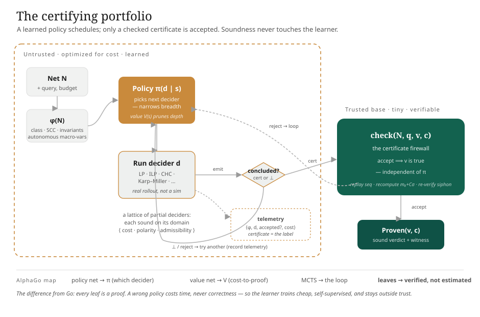

# Soundness as a Free Variable
## The firewall is the enabling property, not the headline — and that honesty relocates the work

> Status: design essay. Exploratory work (Daniel Dyer, with Claude), built on Michael's tool. The core Petri-net theory is Michael's; the proposed extensions are marked as such. This essay was **rewritten under a ratified inversion of its own earlier emphasis**: the soundness theorem, which an earlier draft put at the centre, is here demoted to what it actually is — a one-line corollary whose value lies entirely in a precondition the code does not yet satisfy. What the project *contributes* is not the theorem but **the firewall built and measured**: the certificate-and-checker as the trusted base, and the certifying fraction `f` as the figure of merit. The companion to this demotion is the empirical headline — the structural-coverage fraction `f_struct` — developed in [the-coverage-claim.md](the-coverage-claim.md). The learned-selection material that an earlier draft foregrounded is moved to its honest place as a sequel: §6 and the [rung essays](rung-1-empirical-hardness-ranker.md).

**Abstract.** `petrivet` is a *certifying* analyzer: every decider that concludes can, in principle, emit a machine-checkable witness, and a small external checker re-validates it against the original net. From this one fact a theorem follows immediately — *over a portfolio of certifying deciders, the verdict's soundness is independent of which decider is selected and in what order*. We state that theorem precisely and then say, in plain terms, what it is: **nearly trivial.** It is a one-line composition of certifying algorithms (McConnell–Mehlhorn–Näher, 2011) with algorithm selection (Rice, 1976; SATzilla). This triviality is not a defect to hide; it is a signpost. It tells us the real content is not in the theorem but in its *precondition* — "every fast decider is certifying" — which the code **violates today**, in two stubs that return a confident, fabricated `false`. The contribution this essay actually defends is therefore the firewall **built and measured**: discharge the precondition (demote the stubs to honest abstention), reduce the trusted base to the certificate *checker* alone (the GRAT discipline — an unverified generator, a small verified checker), and report the **certifying fraction `f`** — the share of accepted verdicts that carry a checked certificate — holding it non-increasing in CI. We make precise the one sense in which "soundness is a free variable" is exactly true (the learner may be arbitrarily wrong about *cost* while being structurally incapable of being wrong about *truth*), which is what makes the selection sequel safe and what makes it honest to defer that sequel. We close at the one place the firewall must be *proven* rather than assumed: certified reductions, where a buggy lift is caught only because the checker re-validates against the original net.

---

## 1. What is actually being claimed

A decision problem `petrivet` answers — reachability, liveness, boundedness — has a worst case no engineering removes: EXPSPACE-hard where decidable, Ackermannian in the unbounded case. The tool is nonetheless fast on real nets, because it does not solve the worst case. It dispatches each net to the cheapest technique its structure admits, returning `Inconclusive` rather than overstating where no cheap technique applies ([`reachability.rs`](../../petrivet/src/api/system/reachability.rs)).

There are two very different claims one can attach to this design, and the central act of this essay is to keep them apart.

The first is **empirical and falsifiable**: *on the real MCC P/T corpus, a polynomial structural certifying tier decides a large, characterizable fraction of queries — call it `f_struct` — without state-space exploration, and where it abstains, it abstains honestly.* This is the headline. It can be wrong: the fraction might be small, or the structural path might not be cheaper than exploration, or the certificates might not be independently checkable. Its falsifier is a corpus table. It is developed in [the-coverage-claim.md](the-coverage-claim.md) and is the committed thesis claim.

The second is **structural and nearly certain**: *no matter which decider the tool selects, the answer it returns is sound.* This is the soundness firewall. It is the subject of this essay. It is not the headline — it is the property that makes the headline's measurement *trustworthy* and the eventual learned-selection sequel *safe*. An earlier draft of this document mistook the firewall for the contribution. It is not. It is the enabling condition. Stating it as a theorem is easy; the work is in earning its precondition and measuring its reach.

---

## 2. The theorem, stated precisely

Fix a property $P$ (say, reachability of a target marking) and a net $N$ with query $q$. A **decider** $d$ is a partial procedure returning either $\bot$ (inconclusive) or a verdict $v \in \{\textsf{yes}, \textsf{no}\}$ together with a certificate $c$. Call $d$ **certifying** if there is a checker $\mathrm{chk}_P(N, q, v, c) \in \{\textsf{accept}, \textsf{reject}\}$ that is *sound*: $\textsf{accept} \Rightarrow v$ is the true answer to $P$ on $(N, q)$. The checker — not the decider — is the trusted computing base. A **policy** $\pi$ chooses which decider to run next, as a function of the net, the query, and the history of attempts.

> **Theorem (soundness is policy-independent).** Let $D$ be a portfolio of certifying deciders for $P$, each with a sound checker $\mathrm{chk}_P$. Run them under any policy $\pi$, accepting a verdict only when its certificate passes $\mathrm{chk}_P$. Then the accepted verdict is the true answer to $P$ on $(N, q)$, for every $\pi$.

**Proof.** The execution returns $v$ only when some decider produced $(v, c)$ and $\mathrm{chk}_P(N, q, v, c) = \textsf{accept}$. By soundness of the checker, $\textsf{accept} \Rightarrow v$ is true. The policy $\pi$ governs only *which* $(v, c)$ pairs are generated and *in what order* they are tested; it cannot accept an unchecked certificate nor alter $\mathrm{chk}_P$. Hence the accepted verdict is true irrespective of $\pi$. $\blacksquare$

> **Corollary (learning is confined to performance).** Because the conclusion holds for *all* $\pi$, the policy may be optimized for any performance objective — expected time, resource budget, anytime quality — by any procedure, including reinforcement learning under a misspecified reward. A wrong policy wastes time; it cannot return a wrong answer. The learner lies entirely outside the trusted base $\{\mathrm{chk}_P\}$.

---

## 3. The theorem is nearly trivial — and that is the point

Read the proof again. It is one paragraph, and every step is a definition unfolding. *Certifying* was defined as "$\textsf{accept} \Rightarrow$ true"; the policy was defined as "chooses order, nothing else"; the conclusion is the conjunction. There is no induction, no case analysis, no inequality. It is a corollary of two results that predate this project by decades:

- **Certifying algorithms** (McConnell, Mehlhorn, Näher, Schweitzer, *Computer Science Review*, 2011): an algorithm should emit a witness a simple checker can verify, moving trust from the (complex, possibly buggy) solver to the (simple, auditable) checker. The SAT community's DRAT/GRAT discipline is the canonical instance — trust only the tiny verified `gratchk`, never the unverified `gratgen` (Lammich, *CADE* 2017).
- **Algorithm selection** (Rice, *Advances in Computers*, 1976; operationalized by SATzilla — Xu, Hutter, Hoos, Leyton-Brown, *JAIR* 2008): choose, per instance, which of several procedures to run, using cheap features of the instance.

Compose them — "select among procedures, each of which is certifying" — and the theorem falls out with no further mathematics. **As a theorem it earns no credit.** Saying so is not modesty for its own sake; it is the load-bearing move of this essay, because it forces the question: *if the theorem is free, where is the work?*

The work is in the **precondition**. The theorem's entire non-trivial content is the hypothesis that *every decider in the portfolio is certifying.* A decider that returns a bare verdict with no checkable witness is, in effect, part of the trusted base; scheduling it under any $\pi$ neither protects nor repairs it. The strength of the firewall is therefore *exactly* the fraction of the decider set that is certifying — and nothing in the theorem makes that fraction large. Making it large is engineering, and it is the actual project.

---

## 4. Where the code violates the precondition today

The precondition is not satisfied. Two deciders return a *definitive* `Some(false)` — a confident negative verdict — where the underlying theory gives an exact answer they have simply not computed. They are not abstaining; they are asserting, and one of them asserts a falsehood.

**The first** is `is_covered_by_s_components`, which returns `false` unconditionally:

```rust
// petrivet/src/api/net/mod.rs:270
pub fn is_covered_by_s_components(&self) -> bool {
    // todo
    false
}
```

This is consumed on the live-free-choice boundedness path at [`boundedness.rs:67`](../../petrivet/src/api/system/boundedness.rs): a live free-choice net is bounded iff every place lies in an S-component, so a hardcoded `false` reports a genuinely bounded net as *not* efficiently bounded. Here the damage is contained — `is_efficiently_bounded` returns `Some(false)`, the caller falls through to `is_structurally_bounded` and the coverability graph ([`boundedness.rs:141`](../../petrivet/src/api/system/boundedness.rs)) — but the *shape* is the violation: a fast decider asserting a verdict it has not earned.

**The second** is the marked-graph arm of `is_efficiently_live`:

```rust
// petrivet/src/api/system/liveness.rs:106-108
NetClass::MarkedGraph => {
    Some(false) // todo  ← liveness.rs:107, the fabricated negative verdict
},
```

A marked graph is live iff every circuit is marked — an exact, polynomial structural test. Returning `Some(false)` reports *every* marked graph as non-live. Because `is_live` short-circuits on `is_efficiently_live` ([`liveness.rs:118`](../../petrivet/src/api/system/liveness.rs)) before consulting the reachability graph, this is **trusted-but-wrong**: a live marked graph is reported non-live with no fallback. This is the real soundness defect in the present construction, and — the point that the inversion sharpens — **it is not the machine learning.** No learned policy is anywhere near it. It is a `// todo` in a `match` arm.

The near-term first move is therefore not to build a learner. It is to **demote both stubs to abstention**: a decider that cannot yet certify must return `None` and escalate, never a fabricated `Some(false)`. This is item **A2** in the [backlog](../../BACKLOG.md) — "the near-term north star and the precondition of the firewall" — and the stated first move in [for-michael.md](for-michael.md): *"there are two places in your code that confidently return the wrong answer where the theory gives a real one … Start there."* Demotion is the floor; the eventual ceiling is to make each arm emit a certificate (the S-component cover; the circuit token counts — backlog B3, B4), which converts abstention into a checked positive verdict. The evidence calculus and the decision portfolio are one project, and A2 is where it begins.

There is a quieter cousin worth naming for honesty's sake. The `Unreachable` verdict on the general path rests on the *floating-point* LP failing to find a rational solution ([`reachability.rs:172`](../../petrivet/src/api/system/reachability.rs)). A spurious numerical "infeasible" on a genuinely feasible system would be a silent false `Unreachable` — and the firewall does **not** protect it, because on the negative path there is no positive witness to re-check (backlog B1a). This is a different and subtler obligation than the two stubs: it argues that negative verdicts must be re-derived in exact arithmetic before they are trusted. It belongs to the same discipline — *no verdict without a checkable reason* — and is flagged here so the firewall's coverage is not overstated.

---

## 5. The trusted base, the checker, and the figure of merit `f`

Once the precondition is discharged, the firewall has a precise extent, and that extent is measurable. The trusted base is not "the tool"; it is

$$ \text{TCB} \;=\; \{\text{certificate checkers}\} \;\cup\; \{\text{remaining bare-boolean deciders}\}. $$

The design goal, following the GRAT discipline, is to shrink the right-hand union to empty and the left-hand set to something small enough to audit and eventually to verify formally. Each checker must re-establish the property against the **original** $(N, q)$ — assuming nothing about which decider or reduction produced the witness, sharing no code with the generators beyond primitive net access (backlog C1). That original-net discipline is what holds the trusted base constant under reduction-lifting (§7) and what would let the certificate format be tool-agnostic. The trust boundary is a single line in the decision loop:

```rust
if certificate.check(net, m0, query) {        // the trusted base — and the precondition of §3
    return Verdict::Proven(verdict, certificate);
}
```

The figure of merit for the firewall is the **certifying fraction**

$$ f \;=\; \frac{\#\{\text{accepted verdicts carrying a checked certificate}\}}{\#\{\text{accepted verdicts}\}}. $$

`f = 1` means the firewall is total: every answer the tool commits to is backed by a witness an independent checker accepted, and the bare-boolean trusted base is empty. `f < 1` names exactly how far short of that the tool falls — it is the honest accounting of the gap between the theorem's hypothesis and the code's reality. The discipline (backlog A6, C5) is to **report `f` over the corpus and require the bare-boolean trusted base to be non-increasing in CI**: every release may certify more, never less. This is the firewall as a *built and measured* artifact rather than a stated theorem — a number that can be tracked, regressed against, and pointed at. It is the contribution.

Two further measurements complete the picture, and both are independent of any learner: the **check-pass rate** (every certificate produced in testing must re-validate, or CI fails — backlog C2, reported as a result in G6), and the **map of the checkable frontier** ([the-checkable-frontier.md](the-checkable-frontier.md); backlog C7) — the per-property, per-polarity table of where compact certificates exist (positive reachability as a firing word; LP-refuted unreachability as a one-dot-product Farkas invariant; structural boundedness as a place invariant) and where complexity theory appears to forbid them (general non-free-choice liveness; integer-only infeasibility, whose honest witness is a super-polynomial cutting-plane derivation). The frontier map is where the firewall meets its limits with the same candor it meets its successes.

---

## 6. "A free variable" — stated exactly, and why deferral is honest

The slogan in the title is precise and worth stating without ornament. *Soundness is a free variable* means: **the learner is free to be arbitrarily wrong about cost while being structurally incapable of being wrong about truth.** Cost — which decider is fastest on this net, when to abandon a slow solve, which order minimizes expected time — is the variable the learner optimizes, and it may misjudge it badly: a bad ranker can be slower than the hand-ordered cascade. Truth — whether the returned verdict is correct — is held constant by the checker, the same value for every $\pi$. The learner moves the first freely and cannot touch the second.

This is what makes the eventual selection sequel *safe*, and it is what makes deferring that sequel *honest*. The honest lineage of that sequel is **SATzilla / Rice algorithm selection** — a cost-sensitive ranker over structural features, sound by the theorem, no deep learning required — escalating later to a sequential policy and, at the far end, a planner over certified reductions (the rungs of [rung-1-empirical-hardness-ranker.md](rung-1-empirical-hardness-ranker.md), [rung-2-sequential-policy.md](rung-2-sequential-policy.md), [rung-3-certified-reductions.md](rung-3-certified-reductions.md)). It is a *sequel* in the strict sense: it is gated behind the firewall (a mis-selection must cost time, never soundness — backlog D5–D8), and it is justified only by a *measured* gap between the single-best and virtual-best decider on the corpus. If that gap is within noise on a six-arm portfolio, the hand-ordered cascade is the honest answer and the learner is dead weight. Because the firewall makes the verdict sound regardless, we can *afford* to wait for the measurement rather than build on a hope — the certifying spine is what makes the deferral free of risk. An earlier draft inverted this, casting the learner as the destination and the firewall as a supporting lemma. The corrected order: the firewall is the contribution, the coverage fraction is the headline, and the learner is the safe, deferrable sequel.

One framing the earlier draft leaned on is retired here as a load-bearing argument: the AlphaGo / MuZero analogy. It is a real and instructive contrast — Go's leaves are *estimated*, so a wrong value network costs the game, whereas `petrivet`'s leaves are *checked*, so a wrong policy costs milliseconds — but the contrast makes `petrivet`'s problem *easier and different*, not grander. It is kept as one clarifying sentence, not as a thesis. Likewise the effective-theory and cellular-automata material — coarse-graining an intractable substrate into a predictive macro-theory — is genuinely interesting as a *feature-design heuristic* (prefer structural macro-features whose mutual information with hardness is high at low description length; backlog X4) but it is **labelled speculation, never a soundness argument**. The firewall stands on the checker alone.

---

## 7. The one place the firewall must be proven, not assumed

There is a single point in the construction where the firewall is not free, and intellectual honesty requires naming it. It is **certified reductions** ([rung-3-certified-reductions.md](rung-3-certified-reductions.md); backlog Epic F).

A reduction is a property-preserving transformation carrying an applicability witness and a `lift` that maps a certificate on the *residual* net back to the *original*. The firewall's promise is that even a buggy `lift` cannot break soundness, because the lifted certificate is re-checked against the original net: a wrong lift produces a certificate the original-net checker rejects, the search backtracks, and the cost is time, not correctness. That argument is clean — *for existential witnesses.* A firing sequence either fires on the original net or it does not; the checker replays it and the bug is caught.

It is **not** automatically clean for **compositional or invariant** lifts. A buggy interface correction could, in principle, produce a *too-weak* certificate that the checker accepts — the witness checks out, but it witnesses less than the property requires. There the robustness property is no longer a corollary of "re-check against the original net"; it becomes a per-certificate-kind **checker-completeness obligation** that must be *proven*, not assumed. The disciplined response (backlog F1): restrict the *trusted* reduction lifts to existential witnesses until the compositional checker-completeness obligation is discharged for each compositional certificate kind. This is the one open theoretical liability in an otherwise free firewall, and it is recorded as such rather than papered over. The boundary between what the checker buys for free and what it does not is mapped in [the-checkable-frontier.md](the-checkable-frontier.md).

---

## 8. What this essay commits to, and what it hands off

The reconciled position, stated as plainly as the mathematics allows:

- The soundness theorem is true and nearly trivial — a corollary of certifying algorithms composed with algorithm selection. Its value is not as a result but as a *signpost* to its precondition.
- The precondition — every fast decider is certifying — is **violated today** in the two `Some(false)` stubs ([`api/net/mod.rs:270`](../../petrivet/src/api/net/mod.rs); [`liveness.rs:107`](../../petrivet/src/api/system/liveness.rs)). Demoting them to honest abstention (backlog A2) is the near-term first move and the precondition of everything downstream.
- The contribution is the **firewall built and measured**: the trusted base reduced to the certificate *checker* (the GRAT discipline), with the certifying fraction `f` reported and held non-increasing in CI, and the checkable frontier mapped.
- "Soundness is a free variable" means the learner is free to be wrong about cost while structurally unable to be wrong about truth. This makes the [selection sequel](rung-1-empirical-hardness-ranker.md) safe and makes deferring it honest.
- The one place the firewall must be *proven* rather than assumed is the compositional `lift` ([rung-3-certified-reductions.md](rung-3-certified-reductions.md)); existential lifts are sound for free, compositional ones carry an open obligation.

The empirical headline — the structural-coverage fraction `f_struct` and its honest-abstention boundary — is the companion claim, carried in [the-coverage-claim.md](the-coverage-claim.md). The factorization residual that measures what *cannot* be coarse-grained is developed, strictly as mathematics and emphatically not as any claim about minds, in [the-factorization-residual.md](the-factorization-residual.md). The components this design presupposes, dependency-sequenced, are in [foundations/foundational-design.md](../foundations/foundational-design.md) and [foundations/foundations-backlog.md](../foundations/foundations-backlog.md); the condensed statement of the organizing principles is in [core-principles.md](core-principles.md), and the architectural reading that surfaced them in [latent-architecture.md](latent-architecture.md).

The single fact under all of it, the one that holds the whole apparatus safely outside the trusted base: a verdict here is never a guess but a proof — and unlike in Go, every leaf can be checked. The theorem that says so is free. Earning its hypothesis, and measuring how much of it the code has earned, is the work.



---

### References (curated, verified)

- McConnell, Mehlhorn, Näher, Schweitzer. *Certifying algorithms.* Computer Science Review 5(2) (2011). Lammich. *Efficient Verified (UN)SAT Certificate Checking* (GRAT). CADE 2017 / JAR 2019.
- Rice. *The Algorithm Selection Problem.* Advances in Computers 15 (1976). Xu, Hutter, Hoos, Leyton-Brown. *SATzilla.* JAIR 32 (2008). Kotthoff. *Algorithm Selection for Combinatorial Search Problems: A Survey* (2014).
- Blondin, Haase, Offtermatt. *Directed Reachability for Infinite-State Systems* (FastForward). TACAS 2021 — the domain-matched precedent: an LP/continuous over-approximation as a sound-on-success distance oracle for Petri reachability, the witnessing firing sequence self-certifying.
- Si et al. *Code2Inv.* NeurIPS 2018; Giacobbe et al. *Neural Model Checking.* NeurIPS 2024 — learner-proposes / checker-disposes, soundness from the SMT checker. DeepMind. *AlphaProof* (Nature 2025) — every output gated by the Lean kernel.
- Leroux, Schmitz; Czerwiński, Orlikowski — the reachability complexity frontier (Ackermann-complete unbounded; EXPSPACE-hard where decidable), the worst case no policy removes.
- Silver et al. *Mastering the game of Go…* Nature 529 (2016), 550 (2017); Science 362 (2018). Schrittwieser et al. *…planning with a learned model* (MuZero). Nature 588 (2020) — retained only as the clarifying contrast (estimated leaves vs. checked leaves), not as a design justification.

*A note on register, carried from the inversion: where an earlier draft reached for the AlphaGo framing and the effective-theory metaphysics as organizing arguments, this rewrite keeps them as, respectively, one clarifying contrast and one labelled feature-design heuristic. The load-bearing claims here name their falsifiers — the two stubs (a regression test), the fraction `f` (a CI gate), the compositional-lift obligation (a checker-completeness proof) — and rest on the checker alone.*
