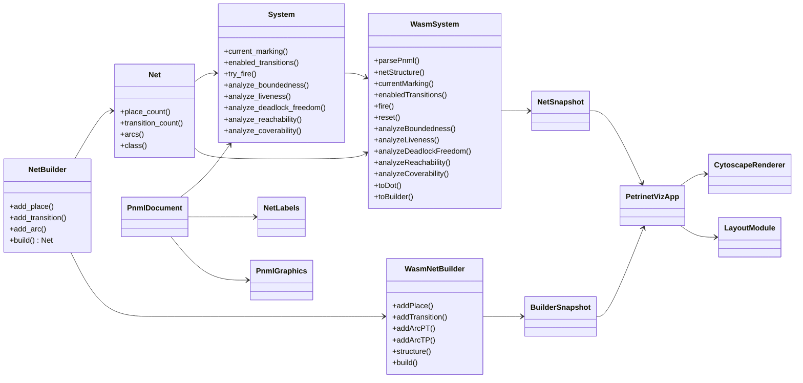

## Petrivet Cross-Layer API Spec

Status: draft
Scope: `petrivet/`, `petrivet-wasm/`, and the browser visualization app.

This document records the current de facto API, the seams between layers, and a proposed split if the visualization stack is divided into a reusable TypeScript binding package plus a presentation app.

### Goals

- Keep the Rust core the source of truth for Petri net semantics.
- Make the WASM/TypeScript surface explicit and stable.
- Separate reusable browser bindings from UI-specific visualization code.
- Preserve a single mental model for identifiers, indices, labels, and analysis results.

### Current Layer Map

#### 1. Core Rust library: `petrivet`

Owns the domain model and algorithms.

- Structure: `net::Net`, `net::NetBuilder`, `marking::Marking`, `system::System`.
- Labels and metadata: `labeled::NetLabels`.
- PNML parsing and conversion: `pnml::PnmlDocument`, `pnml::convert`, `PnmlGraphics`.
- Analysis: boundedness, liveness, deadlock-freedom, reachability, coverability.

This is the only layer that should know the Petri net semantics in detail.

#### 2. WASM bridge: `petrivet-wasm`

Owns the browser-facing adaptation layer.

- `WasmSystem` wraps `System<Rc<Net>>`.
- `WasmNetBuilder` wraps `NetBuilder`.
- Snapshot types expose dense-indexed data to JS:
  - `WasmNetStructure`
  - `WasmBuilderStructure`
  - `WasmArc`, `WasmPosition`, `WasmNetClass`
  - analysis result DTOs for boundedness, liveness, deadlock, reachability, coverability

Current reality: this layer is both a binding layer and a presentation-shaped API. That is the main boundary leak.

#### 3. Browser app: `petrivet-viz`

Owns the UI, interaction model, layout selection, rendering, and teaching copy.

- Cytoscape graph rendering.
- Layout algorithms and animation.
- File input, toolbar, sidebar, modals, and edit mode UX.
- Uses WASM snapshots and mutators, but should not contain Petri net semantics.

### Proposed Split

The current `petrivet-viz` is really two concerns:

1. A reusable browser binding package.
2. A visualization / editor application.

Recommended future names:

- `petrivet-js` or `petrivet-ts` for the reusable TypeScript-facing package.
- `petrinet-viz` for the app on top of it.

I would favor `petrivet-js` if the package is published primarily as a runtime API and `petrivet-ts` if the package is intentionally source-level TypeScript first. For now, the key is the boundary, not the suffix.

### Contract by Layer

#### Core -> WASM contract

The Rust core should continue to export only stable, semantics-first concepts:

- `NetBuilder` creates and validates topologies.
- `Net` is the immutable topology.
- `System` combines a net with a marking.
- `NetLabels` is presentational metadata, but still core-owned.
- PNML conversion returns `(System, NetLabels, PnmlGraphics)`.
- Analysis methods return typed proof/evidence objects.

The WASM layer should only translate these values into JS-friendly forms.

#### WASM -> TypeScript contract

This is the contract that should be treated as de facto stable by the browser layer.

##### Identifier policy

- Public semantic identifiers should stay opaque at the Rust API level.
- `Place` and `Transition` are the authoritative handles in the core library.
- Dense indices are implementation details inside the core crate and a low-level transport shape in WASM snapshots.
- The browser-facing package should not force application code to think in dense indices unless it is explicitly operating on a snapshot DTO.

##### Immutable net snapshot

- `place_count: u32`
- `transition_count: u32`
- `pt_arcs` and `tp_arcs` as dense-indexed arcs
- `place_positions` and `transition_positions`
- `place_names` and `transition_names`
- `net_name`
- `net_class`

Important invariants:

- Dense place indices are `0..place_count-1`.
- Dense transition indices are `0..transition_count-1`.
- Dense indices are stable for the lifetime of the loaded session.
- Arc endpoints always refer to dense indices, never Rust handles.
- Higher-level application code should not depend on those indices as semantic IDs.

##### Simulation / analysis contract

- `currentMarking()` returns one value per place, in dense place order.
- `enabledTransitions()` returns dense transition indices.
- `fire(index)` consumes a dense transition index.
- `reset()` restores the initial marking for the current session.
- `isBounded()`, `isLive()`, `isDeadlockFree()` expose boolean convenience checks.
- `analyze*()` methods return typed result objects with proof metadata.

At the core library level, analysis methods must be documented as operating on the current marking, while `reset()` is the explicit way to return to the initial marking. If the system stores both an initial and current marking, that split should be visible and named in the `System` API.

##### Editing contract

- `WasmNetBuilder` is the editable model.
- Builder node IDs are session-local, stable, monotonic IDs.
- IDs are not reused after removal.
- `structure()` returns a full snapshot suitable for graph editing.
- `build()` compacts the builder into dense indices and returns a new system.

### Boundary Rules

These are the rules I would use to keep the stack from drifting again.

1. Core code never depends on Cytoscape, DOM, or browser layout concerns.
2. The browser app never interprets Rust types directly beyond the exported WASM ABI.
3. The binding package never contains layout algorithms, teaching copy, or view-specific state.
4. All graph rendering code should consume snapshot DTOs, not core internals.
5. Stable identifiers must be documented explicitly:
   - Rust keys are opaque and internal.
   - Dense indices are the browser runtime contract.
   - Builder IDs are editor-session contract IDs.
6. Any new analysis API should be added in core first, then mapped once into WASM, then consumed by the browser.

### Current Friction Points

- `petrivet-wasm` currently exposes both “engine” methods and “editor snapshot” methods in one object.
- `petrivet-viz/src/main.ts` is a large integration file that mixes UI, rendering, interaction, and snapshot interpretation.
- The UI uses dense `p0` / `t0` naming conventions directly, which is convenient but leaks implementation detail into the presentation layer.
- `toDot()` is useful as an export path, but it should not be the main visualization contract.

### Recommended Decomposition

If the split is pursued, I would aim for this ownership model:

- `petrivet`
  - Petri net semantics, analysis, PNML conversion, labels, markings.
- `petrivet-js`
  - WASM initialization.
  - Parsing/loading PNML.
  - Simulation and analysis API.
  - Builder/editing API.
  - Snapshot DTOs and TypeScript declarations.
- `petrinet-viz`
  - Cytoscape integration.
  - Layouts and rendering.
  - Editor UI.
  - Analysis panel and teaching copy.

### Proposed UML

### Working Progress

#### Done

- Mapped the current repo layout.
- Identified the public Rust API surfaces in the core crate.
- Identified the current WASM ABI surface and the browser app coupling points.
- Drafted a first-pass boundary spec.

#### Next

- Decide whether the browser-facing package should be renamed to `petrivet-js` / `petrivet-ts`.
- Decide whether the editor belongs in the binding package or in the app layer.
- Extract a minimal, stable TS-facing contract from the current `WasmSystem` and `WasmNetBuilder`.
- Move UI-only helpers out of the binding layer if the split is adopted.

#### Open Questions

- Should the binding package export only snapshots and mutators, or also a higher-level session object?
- Should dense indices remain the public contract, or should the binding package expose stable string IDs?
- Should `toDot()` stay in the browser-facing API, or move to an export/utilities path?
- Should PNML loading keep the current "first runnable P/T net" behavior, or become explicit about selected net choice?

### Suggested Rule Of Thumb

If a function decides how the graph should look, it belongs in `petrinet-viz`.
If a function decides what the graph is, it belongs in `petrivet` or the binding layer.

