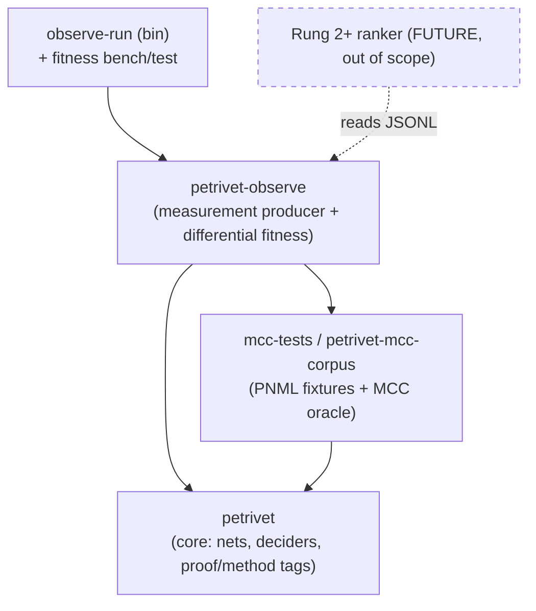

# Self-Measurement Harness — Rung 1 Implementation Plan

> **Alignment note (2026-06-19) — this harness is the experimental rig for the headline numbers.**
>
> Under the ratified inversion ([`docs/essays/README.md`](essays/README.md)), this plan is no longer only the substrate for a future learned ranker — it is the **experimental rig that produces the thesis's headline measurements**. Concretely it yields:
> - **`f`** — the *certifying fraction*: the share of accepted verdicts that carry a checked certificate (the figure of merit for the soundness firewall).
> - **`f_struct`** — the *structural-coverage* number: the fraction of **queries decided** by the polynomial structural tier without state-space exploration, reported **two-denominator** (in-scope; and all-MCC counting out-of-scope as abstain) and evaluated **family-held-out**. This is the falsifiable headline claim.
>
> The **always-on soundness sentinel** (§6) is the live regression guard for the two `Some(false)` stubs (the near-term north star): every `Decided` row with a known oracle must agree, so a trusted-but-wrong verdict fails the build the moment it appears.
>
> This rig is tracked in the authoritative backlog as **epic G** — specifically **G4** (promote the harness to the rig; family-held-out, two-denominator protocol) and **G4a** (the structural-coverage *floor*, runnable now, before any new generators land) — sitting on the measurement substrate of **D2/D3** (the `petrivet-observe` crate, the corpus driver, and the soundness sentinel). The body below is the implementation plan and is unchanged.

Status: draft / proposal
Scope: a new, separable observability domain that turns `petrivet`'s analysis portfolio into a **differential fitness producer** — usable today as a self-measurement / regression-fitness harness, and later as the training-data substrate for learned algorithm selection (Rung 2+).
Author lane: this is an *additive tooling* contribution (Daniel). It deliberately does **not** modify analysis algorithms or introduce a model; core algorithm work remains Michael's. Where a minimal core seam is proposed, it is flagged explicitly as a decision for Michael, and Phase 1 needs **no core change at all**.

Related: [`docs/petrivet-boundary-spec.md`](petrivet-boundary-spec.md) (the domain-separation precedent), and the companion design note *"Soundness as a Free Variable"* (the Rung-ladder this realizes Rung 1 of).

---

## 0. One-paragraph thesis

Observability here is not logging bolted onto analysis; it is a **measurement-producing domain** that observes the existing portfolio of partial deciders and records *how each performed on each instance*. The object it produces is **differential**: absolute timings have no canonical origin (machine speed and load are an arbitrary offset; across machines, cost rescales), so the persisted, comparable fitness is the **ranking and the log-cost differences** among deciders per instance — origin-free. Any particular schedule (today's hardcoded cascade, tomorrow's learned policy) is a *choice of origin* recorded **alongside** the data, never baked **into** it. The harness is therefore simultaneously a self-test (assert differential fitness invariants vs a committed baseline) and a future training set (the certificate is the label), unified by one principle: *measure differences, not absolutes; record the bundle, not a section.*

---

## 1. Purpose and non-goals

### Purpose
1. Produce, over a corpus of nets, a structured record of **per-instance, per-decider** outcomes and costs.
2. Expose that record as a **differential fitness object** (rankings, Pareto fronts, log-ratios) that is machine- and run-invariant.
3. Serve two consumers from one substrate:
   - **Now:** a self-measurement / regression-fitness harness (does a code change move the fitness landscape? does every accepted certificate still agree with the oracle?).
   - **Later:** the labeled dataset a Rung-2 ranker/policy consumes.

### Non-goals (explicit — these keep the domain bounded)
- **No model.** No ranker, policy, RL, or scheduler is built here. This domain *describes* fitness; it does not *act* on it.
- **No new deciders and no algorithm changes.** The harness observes the existing analysis surface; it does not alter how anything is decided.
- **No change to soundness posture.** This domain observes; it never certifies and never schedules. (The `Certificate::check` trust boundary is a separate, upstream concern; this harness *records whether* a check passed, once such a check exists, but does not implement it.)
- **No core dependency inversion.** Nothing in `petrivet` learns about this domain (see §3).

---

## 2. Design principles

### 2.1 Domain separation (the dependency rule)
The dependency arrow points **only toward the core**. Mirroring the boundary-spec's rule (*"the only layer that should know Petri net semantics in detail"* is `petrivet`):

> `petrivet-observe` depends on `petrivet` (and on a thin corpus/oracle provider). **Nothing in `petrivet` depends on `petrivet-observe`.** The core does not know it is being measured.

This is what makes the contribution safe to add and easy to remove: it is a pure downstream observer.

### 2.2 Differential measurement — the torsor principle
The fitness signal is **relative, not absolute**. Stated with an honesty ledger:

| Claim | Status |
|---|---|
| Log-costs across runs/machines form an affine space (torsor) under a global additive shift (= machine speed / log-scale); the invariant content is log-cost **differences** (ratios) and the induced **ranking**. | **Literal.** |
| Per instance, the cost vector over deciders lives in ℝ^D; meaningful fitness lives in the quotient ℝ^D / ℝ·𝟙 (cost modulo uniform shift). A schedule is a choice of origin = a **section**. | **Literal.** |
| The total structure is a **bundle of cost-torsors indexed by the domain** φ(N); schedules are sections of that bundle. | **Precise as "bundle of torsors"; loose as "torsor over domain space"** — the domain is not a group. |
| Any group acts on the feature/domain space itself. | **Not claimed.** |

**Actionable rules this yields (these drive the schema, §4):**
1. Persist **raw fibers** (absolute costs) tagged with their *run context* (machine, git SHA, timestamp) — i.e., tagged with the trivialization they were measured in. Treat them as **non-comparable across runs** except through differential invariants.
2. The analyzable fitness object is **differential**: per-instance ranking + log-ratios + Pareto front. Origin-free; machine-invariant.
3. **Never bake a schedule into the measurement.** The current cascade's choice and any future policy's choice are recorded as *sections alongside* the data, not folded into it.
4. **Fitness tests are differential assertions** against a committed baseline section (§6).

### 2.3 Observe, don't certify; observe, don't schedule
Two seams the harness must not cross, to stay bounded:
- It **does not check certificates** (that is the core/evidence concern). It records the *outcome* of a check when one is available, and otherwise records the verdict + an independent **oracle cross-check** as its truth signal.
- It **does not choose** deciders for production answers. To gather per-decider fibers it *runs deciders it is allowed to run* (§5), but this is measurement, not the product's decision path.

---

## 3. Architecture: bounded contexts

### 3.1 Crate layout
A new workspace member, `petrivet-observe` (name negotiable), plus an optional thin corpus provider.



**Dependency invariant (CI-enforceable):** `petrivet`'s `Cargo.toml` never lists `petrivet-observe`. A `cargo tree`/lint check in CI can assert the arrow direction.

### 3.2 The minimal core seam (decision for Michael) — and the zero-core-change fallback
To record *per-individual-decider* cost vectors (the full torsor fiber), the harness must invoke each partial decider in isolation. Some deciders are crate-internal (`core::analysis::semi_decision`, `siphon_trap`). Two options:

- **Phase 1 (no core change — start here).** Observe the **public `analyze_*` surface**, which already returns *which decider concluded* via its method/proof tag (e.g. [`BoundednessAnalysisMethod`](../petrivet/src/api/system/boundedness.rs), [`LivenessMethod`](../petrivet/src/api/system/liveness.rs), [`ReachabilityProof`/`UnreachabilityProof`](../petrivet/src/api/system/reachability.rs), [`CoverabilityProof`](../petrivet/src/api/system/coverability.rs), [`CommonerHackCriterionResult`](../petrivet/src/api/system/chc.rs)). This yields `(φ, property, decider-that-fired, end-to-end cost, certificate-kind, oracle-agreement)` with **zero changes to `petrivet`**. The fiber is coarse (one cost per instance = the cascade's path), but it is immediately useful for both the fitness test and a first dataset.
- **Phase 2 (one minimal, additive seam — propose to Michael).** Expose the existing partial deciders as a **public, read-only, side-effect-free enumeration** — each callable, each returning `(outcome, certificate)` — *without* any scheduling or policy logic. This is the bounded surface the observer needs to time deciders independently and assemble the full per-instance cost vector. It is additive (it makes already-existing internal deciders individually addressable) and changes no algorithm. Whether and how to expose it is Michael's call; the harness degrades gracefully to Phase-1 granularity without it.

The seam is the *only* point of contact with the core, and even it is optional. Everything else lives in `petrivet-observe`.

---

## 4. The observation data model

Two record types: the raw **`Observation`** (a fiber, run-contextual) and the derived **`FitnessComparison`** (the differential invariant). Serialized as JSONL for append-only, diff-friendly, language-neutral storage.

### 4.1 `Observation` — raw fiber (one per instance × property × decider-attempt)
```jsonc
{
  "schema_version": 1,
  "run": {                       // the trivialization context — never compared across, only within
    "run_id": "...", "git_sha": "...", "host": "...", "cpu": "...", "ts": "..."
  },
  "instance": { "corpus_id": "...", "source": "mcc-2025|fixture", "markers": ["unfinite", ...] },
  "domain":   { "phi": { /* §7 feature vector */ } },
  "property": { "examination": "Liveness|ReachabilityDeadlock|OneSafe|...", "query": null },
  "attempt": {
    "decider_id": "cascade | s_net_token_sum | rational_marking_eq | ilp_marking_eq | chc | structural_bound_lp | karp_miller",
    "outcome":    "Decided | Inconclusive | Timeout | Error | DoNotCompete",
    "verdict":    true,                      // present iff Decided
    "certificate_kind": "FiringSequence | Parikh | SiphonTrap | OmegaMarking | PlaceSubvariant | null",
    "certificate_checked": null,             // bool once Certificate::check exists; null today
    "oracle":     "agree | disagree | unknown",   // independent cross-check (oracle.rs)
    "cost": {                                // RAW fiber — absolute, machine-relative, NOT cross-comparable
      "wall_ns": 471234,
      "states_explored": null,               // machine-invariant counters where cheaply available
      "lp_solves": null
    }
  }
}
```
Notes: `oracle` is the truth signal until `certificate_checked` exists; `value=None` in the oracle (the MCC `?`, see [`oracle.rs`](../mcc-tests/src/oracle.rs)) maps to `unknown`. Prefer machine-invariant counters (`states_explored`, `lp_solves`) as costs *in addition to* wall-time, because they are origin-stable.

### 4.2 `FitnessComparison` — the differential invariant (one per instance × property)
```jsonc
{
  "instance": "...", "property": "...",
  "deciders_attempted": ["...", "..."],
  "decided_by":        ["s_net_token_sum", "karp_miller"],     // who actually concluded
  "ranking":           ["s_net_token_sum", "karp_miller"],     // by cost among deciders — ORIGIN-FREE
  "log_ratios":        { "karp_miller/s_net_token_sum": 9.7 }, // torsor differences (machine-invariant)
  "pareto_front":      ["s_net_token_sum"],                    // non-dominated on (cost, conclusiveness)
  "baseline_section":  "cascade -> s_net_token_sum"            // the trivialization, recorded ALONGSIDE
}
```
This is the object §2.2 makes primary. It carries **no absolute time**. Cross-run and cross-machine analysis use *only* this object; raw `Observation.cost` is for within-run derivation of it.

---

## 5. The measurement producer

A corpus driver in `petrivet-observe` that, for each instance and each supported property:
1. Loads the net (excluded from cost, matching the existing measured-function convention in [`runner.rs`](../mcc-tests/src/runner.rs) — *"the measured function for benchmarks (PNML loading excluded)"*).
2. Computes `φ(N)` once (§7).
3. Runs the **admissible** deciders. Phase 1: run the public `analyze_*` and read the method tag → one `Observation` for the decider that fired. Phase 2: run each admissible decider independently under a per-decider deadline → one `Observation` per decider (the full fiber).
4. Cross-checks each verdict against the oracle.
5. Emits `Observation` rows; a post-pass folds them into `FitnessComparison` rows.

**Timing discipline (torsor-aware):** measure with a monotonic clock; record wall-time *and* invariant counters; tag every row with `run` context; **never** compare `wall_ns` across `run_id`s — only `FitnessComparison` crosses runs. (Today there is no timing anywhere in the workspace — no `Instant`/`Duration` outside QEMU sleeps — so this is greenfield, not a retrofit.)

**Deadlines:** Phase 2 needs a per-decider budget/cancellation so a diverging Karp–Miller exploration doesn't stall the corpus run. The core lacks cooperative cancellation today; the harness can start with a coarse wall-clock timeout per decider invocation (thread + abandon, or process isolation as the existing MCC orchestrator already does) and treat over-budget as `Outcome::Timeout`. A finer cancellation token in the core is a *later, separate* discussion (not Rung 1).

---

## 6. Fitness as a differential test (self-measurement)

The same producer powers a standing **fitness-regression test** — your "fitness-based test." It asserts properties of `FitnessComparison` **relative to a committed baseline section**, so the assertions are origin-free and machine-portable:

- **Soundness sentinel (always-on):** for every `Decided` row with `oracle != unknown`, assert `verdict` agrees with the oracle; and once available, assert `certificate_checked == true`. (This is the cheap, high-value invariant — it catches the trusted-but-wrong stubs.)
- **No-regression (differential):** for each instance, the baseline's chosen decider must remain on the `pareto_front`; and no decider's `log_ratio` vs the per-instance minimum may worsen by more than θ versus the committed baseline `FitnessComparison`. Because the assertion is on log-ratios, it is invariant to running the test on a slower CI machine — exactly the torsor property.
- **Coverage:** track the fraction of corpus instances each property can `Decide` (vs `Inconclusive`/`Timeout`); regressions in coverage fail.

Committing a baseline = committing a *section* (a JSONL snapshot of `FitnessComparison`s). Re-baselining is an explicit, reviewed act. This makes the harness a self-measuring instrument whose tests live in the differential geometry, not in brittle absolute thresholds.

---

## 7. The domain coordinates φ(N)

All Phase-1 features already exist as cheap, mostly-cached accessors (no core change to read them):

| Feature | Accessor | Caching |
|---|---|---|
| `NetClass` + `is_state_machine/marked_graph/free_choice/asymmetric_choice` | [`Net::class()`](../petrivet/src/api/net/mod.rs); [`class.rs` sub-predicates](../petrivet/src/core/class.rs) | cached on `DenseNet`; `const fn` reads |
| `is_strongly_connected` | [`Net::is_strongly_connected()`](../petrivet/src/core/net.rs) | cached (`tarjan_scc == 1`) |
| place / transition / node / arc counts | [`Net::place_count()` …](../petrivet/src/core/net.rs) | O(1) / O(places) |
| `is_structurally_bounded` | [`Net::is_structurally_bounded()`](../petrivet/src/api/net/boundedness.rs) | one LP |
| initial token sum | `marking().total_tokens()` | O(places) |
| #minimal siphons / #with marked trap | via `commoner_hack_criterion()` | poly (side-effect today) |

**One gap (deferred, optional):** NUPN unit-tree shape (depth/width/`unit_count`/`unit_safe`) — the corpus carries it but only `place_count_from_nupn` reads the `<size>` tag ([`models.rs`](../mcc-tests/src/models.rs)). Parsing the unit forest is a small, self-contained addition *in the observe domain* (it reads PNML; it needn't touch the core). Per §4 of the feature-design doctrine, these structural/decomposition features are exactly the "autonomous macro-variables" worth recording — but they are not required for Rung 1.

**Schema discipline:** φ is recorded as raw named fields, not pre-encoded into a model's input vector. Encoding (one-hot, normalization) belongs to the *consumer* (Rung 2), preserving domain separation.

---

## 8. Phased plan

| Phase | Deliverable | Core change? | Value |
|---|---|---|---|
| **0** | `petrivet-observe` crate skeleton + JSONL schema + φ extractor over public accessors | none | foundation; CI dependency-arrow lint |
| **1** | Corpus driver over public `analyze_*`; record `(φ, method-tag, end-to-end cost, oracle-agreement)`; fold into `FitnessComparison`; **soundness-sentinel test** | **none** | immediate self-measurement; first dataset; catches trusted-but-wrong stubs |
| **2** | Per-decider fibers via the minimal public decider enumeration (Michael's call) + per-decider deadlines; full cost vectors | one additive seam | the real torsor fibers; no-regression fitness test |
| **3** | Differential reporting (rankings, Pareto, log-ratio drift dashboards) + committed baselines | none | standing fitness instrument; analysis-ready export for Rung 2 |

Each phase is independently shippable and independently useful. Rung 2 (any ranker/policy) begins only after Phase 3 and is **out of scope here**.

---

## 9. Open decisions (for Michael) and risks

**Decisions for Michael**
1. Whether to expose the **public decider enumeration** (§3.2 Phase 2), and in what shape. Until then, Phase 0–1 proceed on the public API alone.
2. Crate name / location (`petrivet-observe`?), and whether the corpus/oracle access is reused from `mcc-tests` directly or factored into a thin shared `petrivet-mcc-corpus` crate.
3. Whether the soundness-sentinel test (§6) runs in the main CI or a separate, slower corpus job (the corpus is fetched on demand and large).

**Risks / mitigations**
- *Timing noise* → mitigated structurally by the torsor principle (store differentials; record invariant counters; never compare raw across runs).
- *Corpus availability* (the MCC models are fetched, not vendored; tests already skip when absent) → the harness must no-op gracefully on a missing corpus, exactly as the existing datatest harness does.
- *Scope creep into scheduling/ML* → guarded by §1 non-goals and the dependency-arrow lint; if a record starts to encode a decision, it has left this domain.
- *Per-decider deadlines need cancellation the core lacks* → Phase 2 uses coarse thread/process timeouts first; fine-grained cancellation is explicitly out of Rung 1.

---

## 10. Boundary with Rung 2+ (what this hands off)

This domain produces, and stops at, the **differential fitness dataset** (`Observation` + `FitnessComparison` JSONL) plus a standing fitness test. A future learned ranker is a *separate consumer* that reads this data and emits a *section* (a schedule). By construction it cannot affect soundness (the certificate trust boundary, an upstream concern) and it cannot affect this harness (the arrow points the other way). The self-measurement tooling is the contribution; the model is someone else's next move — and the torsor framing is what keeps the measurement honest enough to be worth training on.

---

### Appendix — glossary (so the framing is legible to future readers)
- **Fiber:** the per-instance bundle of measurements (one cost/outcome per decider).
- **Torsor:** a space acted on freely and transitively by a group, with *no distinguished origin* — "a group that forgot its identity." Here: log-costs under global shift; only differences are physical.
- **Section / trivialization:** a consistent choice of origin across the domain. Here: a *schedule* (the cascade, or a learned policy) — recorded alongside the data, never inside it.
- **Differential invariant:** what survives forgetting the origin — rankings and log-ratios. The thing we persist and test against.
